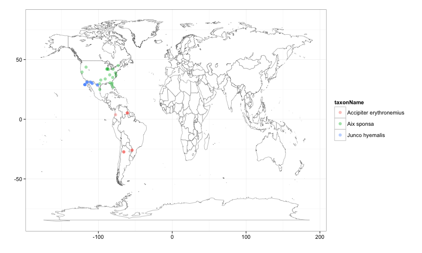

# `rgbif`

<!-- [](https://travis-ci.org/ropensci/rgbif) -->

## About
This set of functions/package will access data from [GBIF](http://www.gbif.org/) using their API methods. 

See documentation the GBIF API here:  
http://data.gbif.org/tutorial/services

## Install

### Install the version from CRAN:

```R
install.packages("rgbif")
require(rgbif)
```

### Install the development version using `install_github` within Hadley's [devtools](https://github.com/hadley/devtools) package.

```R
install.packages("devtools")
require(devtools)

install_github("rgbif", "ropensci")
require(rgbif)
```

Note: 

Windows users have to first install [Rtools](http://cran.r-project.org/bin/windows/Rtools/).

### Packages `rgbif` depends on
+ XML
+ RCurl (>= 1.6)
+ plyr
+ ggplot2
+ maps
+ roxygen2 (as a suggest)

### Visualize occurrence data

#### A single species

```coffee
out <- occurrencelist(scientificname = 'Puma concolor', coordinatestatus = TRUE, maxresults = 100)
gbifmap_list(input = out) # make a map using vertmap
```


#### Many species, colored by species on map

```coffee
splist <- c('Accipiter erythronemius', 'Junco hyemalis', 'Aix sponsa')
out <- occurrencelist_many(splist, coordinatestatus = TRUE, maxresults = 20)
gbifmap_list(out)
```

