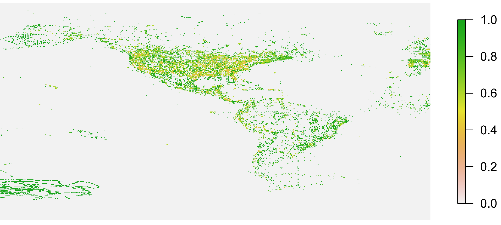

<!-- README.md is generated from README.Rmd. Please edit that file and knit -->


# rgbif 

[](http://www.repostatus.org/#active)
[](https://cranchecks.info/pkgs/rgbif)
[](https://travis-ci.org/ropensci/rgbif)
[](https://codecov.io/github/ropensci/rgbif?branch=master)
[](https://github.com/metacran/cranlogs.app)
[](https://cran.r-project.org/package=rgbif)
[](https://zenodo.org/badge/latestdoi/2273724)

`rgbif` gives you access to data from [GBIF][] via their REST API. GBIF versions their API - we are currently using `v1` of their API. You can no longer use their old API in this package - see `?rgbif-defunct`.

To get started, see:

* [rgbif vignette](https://ropensci.github.io/rgbif/articles/rgbif.html): an introduction to the package's main functionalities.
* [Function reference](https://ropensci.github.io/rgbif/reference/index.html): an overview of all `rgbif` functions.
* [Articles](https://ropensci.github.io/rgbif/articles/index.html): vignettes/tutorials on how to download data, clean data, and work with taxonomic names.
* [Occurrence manual](https://ropensci.github.io/occurrence-manual/): a book covering a suite of R packages used for working with biological occurrence data.

Check out the `rgbif` [paper][] for more information on this package and the sister [Python][pygbif] and [Ruby][gbifrb] clients.

## Package API

The `rgbif` package API follows the GBIF API, which has the following sections:

* `registry` (<https://www.gbif.org/developer/registry>) - Metadata on datasets, and
contributing organizations, installations, networks, and nodes
    * `rgbif` functions: `dataset_metrics()`, `dataset_search()`, `dataset_suggest()`,
    `datasets()`, `enumeration()`, `enumeration_country()`, `installations()`, `networks()`,
    `nodes()`, `organizations()`
    * Registry also includes the GBIF OAI-PMH service, which includes GBIF registry
    data only. `rgbif` functions: `gbif_oai_get_records()`, `gbif_oai_identify()`,
    `gbif_oai_list_identifiers()`, `gbif_oai_list_metadataformats()`,
    `gbif_oai_list_records()`, `gbif_oai_list_sets()`
* `species` (<https://www.gbif.org/developer/species>) - Species names and metadata
    * `rgbif` functions: `name_backbone()`, `name_lookup()`, `name_suggest()`, `name_usage()`
* `occurrences` (<https://www.gbif.org/developer/occurrence>) - Occurrences, both for
the search and download APIs
    * `rgbif` functions: `occ_count()`, `occ_data()`, `occ_download()`, `occ_download_prep()`, `occ_download_queue()`, `occ_download_cancel()`,
    `occ_download_cancel_staged()`, `occ_download_get()`, `occ_download_import()`,
    `occ_download_list()`, `occ_download_meta()`, `occ_download_datasets()`, `occ_download_dataset_activity()`, `occ_get()`, `occ_issues()`,
    `occ_issues_lookup()`, `occ_metadata()`, `occ_search()`
* `maps` (<https://www.gbif.org/developer/maps>) - Map API
    * `rgbif` functions: `map_fetch()`
    * Note: we used to have a function `gbifmap()` that used `ggplot2` to plot data from the
    occurrence API, but it's been removed - see package [mapr][]

## Installation


```r
install.packages("rgbif")
```

Alternatively, install development version


```r
install.packages("devtools")
devtools::install_github("ropensci/rgbif")
```


```r
library("rgbif")
```

> Note: Windows users have to first install [Rtools](https://cran.r-project.org/bin/windows/Rtools/) to use devtools

Mac Users:
(in case of errors)

Terminal:

Install gdal : https://github.com/edzer/sfr/blob/master/README.md#macos

```
brew install openssl
```

in R:


```r
install.packages('openssl')
install.packages('rgeos')
install.packages('rgbif')
```

## Search for occurrence data


```r
occ_search(scientificName = "Ursus americanus", limit = 50)
#> Records found [12339] 
#> Records returned [50] 
#> No. unique hierarchies [1] 
#> No. media records [50] 
#> No. facets [0] 
#> Args [limit=50, offset=0, scientificName=Ursus americanus, fields=all] 
#> # A tibble: 50 x 74
#>    key   scientificName decimalLatitude decimalLongitude issues datasetKey
#>    <chr> <chr>                    <dbl>            <dbl> <chr>  <chr>     
#>  1 1990… Ursus america…            44.9            -62.7 cdrou… 50c9509d-…
#>  2 1990… Ursus america…            40.9           -121.  gass84 50c9509d-…
#>  3 2006… Ursus america…            31.5           -110.  cdrou… 50c9509d-…
#>  4 1986… Ursus america…            30.1           -103.  cdrou… 50c9509d-…
#>  5 1990… Ursus america…            45.4            -93.2 cdrou… 50c9509d-…
#>  6 1990… Ursus america…            35.7            -76.6 cdrou… 50c9509d-…
#>  7 1990… Ursus america…            33.1            -91.9 cdrou… 50c9509d-…
#>  8 1990… Ursus america…            35.6            -82.9 cdrou… 50c9509d-…
#>  9 1990… Ursus america…            29.2            -81.8 cdrou… 50c9509d-…
#> 10 1990… Ursus america…            45.4            -93.1 cdrou… 50c9509d-…
#> # … with 40 more rows, and 68 more variables: publishingOrgKey <chr>,
#> #   networkKeys <chr>, installationKey <chr>, publishingCountry <chr>,
#> #   protocol <chr>, lastCrawled <chr>, lastParsed <chr>, crawlId <int>,
#> #   extensions <chr>, basisOfRecord <chr>, taxonKey <int>,
#> #   kingdomKey <int>, phylumKey <int>, classKey <int>, orderKey <int>,
#> #   familyKey <int>, genusKey <int>, speciesKey <int>,
#> #   acceptedTaxonKey <int>, acceptedScientificName <chr>, kingdom <chr>,
#> #   phylum <chr>, order <chr>, family <chr>, genus <chr>, species <chr>,
#> #   genericName <chr>, specificEpithet <chr>, taxonRank <chr>,
#> #   taxonomicStatus <chr>, dateIdentified <chr>,
#> #   coordinateUncertaintyInMeters <dbl>, stateProvince <chr>, year <int>,
#> #   month <int>, day <int>, eventDate <chr>, modified <chr>,
#> #   lastInterpreted <chr>, references <chr>, license <chr>,
#> #   identifiers <chr>, facts <chr>, relations <chr>, geodeticDatum <chr>,
#> #   class <chr>, countryCode <chr>, country <chr>, rightsHolder <chr>,
#> #   identifier <chr>, verbatimEventDate <chr>, datasetName <chr>,
#> #   gbifID <chr>, verbatimLocality <chr>, collectionCode <chr>,
#> #   occurrenceID <chr>, taxonID <chr>, recordedBy <chr>,
#> #   catalogNumber <chr>, http...unknown.org.occurrenceDetails <chr>,
#> #   institutionCode <chr>, rights <chr>, eventTime <chr>,
#> #   identificationID <chr>, name <chr>, infraspecificEpithet <chr>,
#> #   informationWithheld <chr>, occurrenceRemarks <chr>
```

Or you can get the taxon key first with `name_backbone()`. Here, we select to only return the occurrence data.


```r
key <- name_backbone(name='Helianthus annuus', kingdom='plants')$speciesKey
occ_search(taxonKey=key, limit=20)
#> Records found [44157] 
#> Records returned [20] 
#> No. unique hierarchies [1] 
#> No. media records [18] 
#> No. facets [0] 
#> Args [limit=20, offset=0, taxonKey=9206251, fields=all] 
#> # A tibble: 20 x 86
#>    key   scientificName decimalLatitude decimalLongitude issues datasetKey
#>    <chr> <chr>                    <dbl>            <dbl> <chr>  <chr>     
#>  1 1993… Helianthus an…            33.4          -118.   cdrou… 50c9509d-…
#>  2 1986… Helianthus an…            33.8          -118.   cdrou… 50c9509d-…
#>  3 1990… Helianthus an…            53.9            10.9  cdrou… 6ac3f774-…
#>  4 1990… Helianthus an…            52.6            10.1  cdrou… 6ac3f774-…
#>  5 2235… Helianthus an…            51.2             4.45 ""     7f5e4129-…
#>  6 1993… Helianthus an…            34.0          -117.   cdrou… 50c9509d-…
#>  7 2236… Helianthus an…            26.2           -98.2  cdrou… 50c9509d-…
#>  8 1986… Helianthus an…            27.7           -97.3  cdrou… 50c9509d-…
#>  9 1990… Helianthus an…            26.2           -98.2  cdrou… 50c9509d-…
#> 10 2006… Helianthus an…            27.7           -97.3  cdrou… 50c9509d-…
#> 11 2005… Helianthus an…            27.5           -99.5  cdrou… 50c9509d-…
#> 12 2013… Helianthus an…            25.5          -108.   cdrou… 50c9509d-…
#> 13 1993… Helianthus an…            29.8           -95.2  cdrou… 50c9509d-…
#> 14 2012… Helianthus an…            33.5          -118.   cdrou… 50c9509d-…
#> 15 2006… Helianthus an…            34.6            33.0  cdrou… 50c9509d-…
#> 16 2005… Helianthus an…            31.6          -106.   cdrou… 50c9509d-…
#> 17 2012… Helianthus an…            25.7          -100.   cdrou… 50c9509d-…
#> 18 2005… Helianthus an…            31.5           -97.1  cdrou… 50c9509d-…
#> 19 2012… Helianthus an…            49.3             8.55 gass84 50c9509d-…
#> 20 2013… Helianthus an…            28.6           -98.2  cdrou… 50c9509d-…
#> # … with 80 more variables: publishingOrgKey <chr>, networkKeys <chr>,
#> #   installationKey <chr>, publishingCountry <chr>, protocol <chr>,
#> #   lastCrawled <chr>, lastParsed <chr>, crawlId <int>, extensions <chr>,
#> #   basisOfRecord <chr>, taxonKey <int>, kingdomKey <int>,
#> #   phylumKey <int>, classKey <int>, orderKey <int>, familyKey <int>,
#> #   genusKey <int>, speciesKey <int>, acceptedTaxonKey <int>,
#> #   acceptedScientificName <chr>, kingdom <chr>, phylum <chr>,
#> #   order <chr>, family <chr>, genus <chr>, species <chr>,
#> #   genericName <chr>, specificEpithet <chr>, taxonRank <chr>,
#> #   taxonomicStatus <chr>, dateIdentified <chr>,
#> #   coordinateUncertaintyInMeters <dbl>, stateProvince <chr>, year <int>,
#> #   month <int>, day <int>, eventDate <chr>, modified <chr>,
#> #   lastInterpreted <chr>, references <chr>, license <chr>,
#> #   identifiers <chr>, facts <chr>, relations <chr>, geodeticDatum <chr>,
#> #   class <chr>, countryCode <chr>, country <chr>, rightsHolder <chr>,
#> #   identifier <chr>, verbatimEventDate <chr>, datasetName <chr>,
#> #   gbifID <chr>, verbatimLocality <chr>, collectionCode <chr>,
#> #   occurrenceID <chr>, taxonID <chr>, recordedBy <chr>,
#> #   catalogNumber <chr>, http...unknown.org.occurrenceDetails <chr>,
#> #   institutionCode <chr>, rights <chr>, eventTime <chr>,
#> #   occurrenceRemarks <chr>, identificationID <chr>, name <chr>,
#> #   locality <chr>, individualCount <int>, continent <chr>,
#> #   informationWithheld <chr>, nomenclaturalCode <chr>,
#> #   municipality <chr>, identificationVerificationStatus <chr>,
#> #   language <chr>, type <chr>, vernacularName <chr>,
#> #   samplingProtocol <chr>, datasetID <chr>, accessRights <chr>,
#> #   reproductiveCondition <chr>
```

## Search for many species

Get the keys first with `name_backbone()`, then pass to `occ_search()`


```r
splist <- c('Accipiter erythronemius', 'Junco hyemalis', 'Aix sponsa')
keys <- sapply(splist, function(x) name_backbone(name=x)$speciesKey, USE.NAMES=FALSE)
occ_search(taxonKey=keys, limit=5, hasCoordinate=TRUE)
#> Occ. found [2480598 (20), 9362842 (5522131), 2498387 (1823909)] 
#> Occ. returned [2480598 (5), 9362842 (5), 2498387 (5)] 
#> No. unique hierarchies [2480598 (1), 9362842 (1), 2498387 (1)] 
#> No. media records [2480598 (3), 9362842 (5), 2498387 (5)] 
#> No. facets [2480598 (0), 9362842 (0), 2498387 (0)] 
#> Args [hasCoordinate=TRUE, limit=5, offset=0,
#>      taxonKey=2480598,9362842,2498387, fields=all] 
#> 3 requests; First 10 rows of data from 2480598
#> 
#> # A tibble: 5 x 91
#>   key   scientificName decimalLatitude decimalLongitude issues datasetKey
#>   <chr> <chr>                    <dbl>            <dbl> <chr>  <chr>     
#> 1 1978… Accipiter ery…          -22.4             -42.9 ""     b1047888-…
#> 2 1001… Accipiter ery…          -27.6             -58.7 cudc,… ad43e954-…
#> 3 1001… Accipiter ery…          -27.9             -59.1 cudc,… ad43e954-…
#> 4 1934… Accipiter ery…          -24.3             -48.4 cdrou… b1047888-…
#> 5 6862… Accipiter ery…            5.27            -60.7 cdrou… e635240a-…
#> # … with 85 more variables: publishingOrgKey <chr>, networkKeys <chr>,
#> #   installationKey <chr>, publishingCountry <chr>, protocol <chr>,
#> #   lastCrawled <chr>, lastParsed <chr>, crawlId <int>, extensions <chr>,
#> #   basisOfRecord <chr>, taxonKey <int>, kingdomKey <int>,
#> #   phylumKey <int>, classKey <int>, orderKey <int>, familyKey <int>,
#> #   genusKey <int>, speciesKey <int>, acceptedTaxonKey <int>,
#> #   acceptedScientificName <chr>, kingdom <chr>, phylum <chr>,
#> #   order <chr>, family <chr>, genus <chr>, species <chr>,
#> #   genericName <chr>, specificEpithet <chr>, taxonRank <chr>,
#> #   taxonomicStatus <chr>, year <int>, month <int>, day <int>,
#> #   eventDate <chr>, lastInterpreted <chr>, references <chr>,
#> #   license <chr>, identifiers <chr>, facts <chr>, relations <chr>,
#> #   geodeticDatum <chr>, class <chr>, countryCode <chr>, country <chr>,
#> #   rightsHolder <chr>, identifier <chr>, verbatimEventDate <chr>,
#> #   nomenclaturalCode <chr>, locality <chr>, gbifID <chr>,
#> #   collectionCode <chr>, occurrenceID <chr>, recordedBy <chr>,
#> #   catalogNumber <chr>, vernacularName <chr>, fieldNotes <chr>,
#> #   eventTime <chr>, verbatimElevation <chr>, behavior <chr>,
#> #   higherClassification <chr>, name <chr>, modified <chr>, created <chr>,
#> #   associatedSequences <chr>, taxonID <chr>, sex <chr>,
#> #   establishmentMeans <chr>, continent <chr>, institutionID <chr>,
#> #   dynamicProperties <chr>, fieldNumber <chr>, language <chr>,
#> #   type <chr>, preparations <chr>, occurrenceStatus <chr>,
#> #   institutionCode <chr>, higherGeography <chr>,
#> #   georeferenceVerificationStatus <chr>, endDayOfYear <chr>,
#> #   datasetName <chr>, verbatimLocality <chr>, otherCatalogNumbers <chr>,
#> #   startDayOfYear <chr>, accessRights <chr>, collectionID <chr>
```

## Maps

We've removed `gbifmap()` which helped users plot data from functions `occ_search()`/`occ_data()` - instead we strongly recommend using our other package [mapr][].

As of `rgibf v1`, we have integration for GBIF's mapping API, which lets you get raster images of
occurrences of taxa of interest. For example:


```r
x <- map_fetch(taxonKey = 3118771, year = 2010)
x
#> class       : RasterLayer 
#> dimensions  : 512, 512, 262144  (nrow, ncol, ncell)
#> resolution  : 0.703125, 0.3515625  (x, y)
#> extent      : -180, 180, -90, 90  (xmin, xmax, ymin, ymax)
#> coord. ref. : +init=epsg:4326 +proj=longlat +datum=WGS84 +no_defs +ellps=WGS84 +towgs84=0,0,0 
#> data source : in memory
#> names       : layer 
#> values      : 0, 1  (min, max)
```


```r
library(raster)
plot(x, axes = FALSE, box = FALSE)
```



## Screencast

<a href="https://vimeo.com/127119010"></a>

## Contributors

Collected via GitHub Issues, this list honors all contributors in alphabetical order. Code contributors are in bold.

[adamdsmith](https://github.com/adamdsmith) - [AgustinCamacho](https://github.com/AgustinCamacho) - [AlexPeap](https://github.com/AlexPeap) - [andzandz11](https://github.com/andzandz11) - [AugustT](https://github.com/AugustT) - **[benmarwick](https://github.com/benmarwick)** - [cathynewman](https://github.com/cathynewman) - [cboettig](https://github.com/cboettig) - [coyotree](https://github.com/coyotree) - **[damianooldoni](https://github.com/damianooldoni)** - [dandaman](https://github.com/dandaman) - [djokester](https://github.com/djokester) - [dlebauer](https://github.com/dlebauer) - **[dmcglinn](https://github.com/dmcglinn)** - [dnoesgaard](https://github.com/dnoesgaard) - [DupontCai](https://github.com/DupontCai) - [elgabbas](https://github.com/elgabbas) - [fxi](https://github.com/fxi) - [ghost](https://github.com/ghost) - [gkburada](https://github.com/gkburada) - [hadley](https://github.com/hadley) - **[JanLauGe](https://github.com/JanLauGe)** - **[jarioksa](https://github.com/jarioksa)** - [jhpoelen](https://github.com/jhpoelen) - [jkmccarthy](https://github.com/jkmccarthy) - **[johnbaums](https://github.com/johnbaums)** - [jwhalennds](https://github.com/jwhalennds) - **[karthik](https://github.com/karthik)** - [kgturner](https://github.com/kgturner) - [Kim1801](https://github.com/Kim1801) - [ljuliusson](https://github.com/ljuliusson) - [luisDVA](https://github.com/luisDVA) - [martinpfannkuchen](https://github.com/martinpfannkuchen) - [MattBlissett](https://github.com/MattBlissett) - [maxhenschell](https://github.com/maxhenschell) - [Pakillo](https://github.com/Pakillo) - **[peterdesmet](https://github.com/peterdesmet)** - [PhillRob](https://github.com/PhillRob) - [poldham](https://github.com/poldham) - [qgroom](https://github.com/qgroom) - [raymondben](https://github.com/raymondben) - [rossmounce](https://github.com/rossmounce) - [sacrevert](https://github.com/sacrevert) - **[sckott](https://github.com/sckott)** - [scottsfarley93](https://github.com/scottsfarley93) - **[SriramRamesh](https://github.com/SriramRamesh)** - [stevenpbachman](https://github.com/stevenpbachman) - [stevensotelo](https://github.com/stevensotelo) - [TomaszSuchan](https://github.com/TomaszSuchan) - [vandit15](https://github.com/vandit15) - [vervis](https://github.com/vervis) - **[vijaybarve](https://github.com/vijaybarve)** - [willgearty](https://github.com/willgearty) - [zixuan75](https://github.com/zixuan75)

## Meta

* Please [report any issues or bugs](https://github.com/ropensci/rgbif/issues).
* License: MIT
* Get citation information for `rgbif` in R doing `citation(package = 'rgbif')`
* Please note that this project is released with a [Contributor Code of Conduct](.github/CODE_OF_CONDUCT.md). By participating in this project you agree to abide by its terms.

- - -

This package is part of a richer suite called [spocc - Species Occurrence Data](https://github.com/ropensci/spocc), along with several other packages, that provide access to occurrence records from multiple databases.

- - -

[](https://ropensci.org)

[mapr]: https://github.com/ropensci/mapr
[paper]: https://peerj.com/preprints/3304/
[GBIF]: https://www.gbif.org/
[pygbif]: https://github.com/sckott/pygbif
[gbifrb]: https://github.com/sckott/gbifrb
