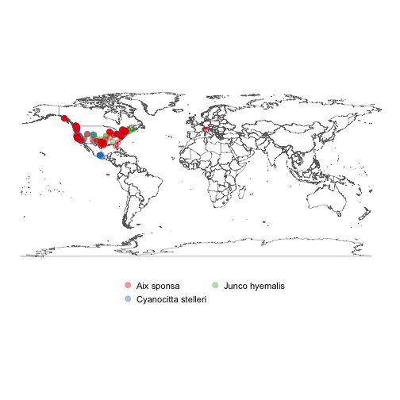

rgbif
=====


[](https://travis-ci.org/ropensci/rgbif)
[](https://github.com/metacran/cranlogs.app)
[](https://cran.r-project.org/package=rgbif)
[](https://codecov.io/github/ropensci/rgbif?branch=master)

`rgbif` gives you access to data from [GBIF](http://www.gbif.org/) via their REST API. GBIF versions their API - we are currently using `v1` of their API. You can no longer use their old API in this package - see `?rgbif-defunct`.

Tutorials:

* [rgbif vignette - the intro to the package](vignettes/rgbif_vignette.Rmd)
* [issues vignette - how to clean GBIF data](vignettes/issues_vignette.Rmd)
* [taxonomic names - examples of some confusing bits](vignettes/taxonomic_names.Rmd)

## Package API

The `rgbif` package API follows the GBIF API, which has the following sections:

* `registry` (<http://www.gbif.org/developer/registry>) - Metadata on datasets, and
contributing organizations, installations, networks, and nodes
    * `rgbif` functions: `dataset_metrics()`, `dataset_search()`, `dataset_suggest()`,
    `datasets()`, `enumeration()`, `enumeration_country()`, `installations()`, `networks()`,
    `nodes()`, `organizations()`
    * Registry also includes the GBIF OAI-PMH service, which includes GBIF registry
    data only. `rgbif` functions: `gbif_oai_get_records()`, `gbif_oai_identify()`,
    `gbif_oai_list_identifiers()`, `gbif_oai_list_metadataformats()`,
    `gbif_oai_list_records()`, `gbif_oai_list_sets()`
* `species` (<http://www.gbif.org/developer/species>) - Species names and metadata
    * `rgbif` functions: `name_backbone()`, `name_lookup()`, `name_suggest()`, `name_usage()`
* `occurrences` (<http://www.gbif.org/developer/occurrence>) - Occurrences, both for
the search and download APIs
    * `rgbif` functions: `occ_count()`, `occ_data()`, `occ_download()`, `occ_download_cancel()`,
    `occ_download_cancel_staged()`, `occ_download_get()`, `occ_download_import()`,
    `occ_download_list()`, `occ_download_meta()`, `occ_get()`, `occ_issues()`,
    `occ_issues_lookup()`, `occ_metadata()`, `occ_search()`

The GBIF `maps` API (<http://www.gbif.org/developer/maps>) is not implemented in `rgbif`,
and are meant more for intergration with web based maps.

## Installation


```r
install.packages("rgbif")
```

Alternatively, install development version


```r
install.packages("devtools")
devtools::install_github("ropensci/rgbif")
```


```r
library("rgbif")
```

> Note: Windows users have to first install [Rtools](https://cran.r-project.org/bin/windows/Rtools/) to use devtools

## Search for occurrence data


```r
occ_search(scientificName = "Ursus americanus", limit = 50)
#> Records found [8424] 
#> Records returned [50] 
#> No. unique hierarchies [1] 
#> No. media records [43] 
#> No. facets [0] 
#> Args [scientificName=Ursus americanus, limit=50, offset=0, fields=all] 
#> # A tibble: 50 × 68
#>                name        key decimalLatitude decimalLongitude
#>               <chr>      <int>           <dbl>            <dbl>
#> 1  Ursus americanus 1229610234        44.06062        -71.92692
#> 2  Ursus americanus 1253300445        44.65481        -72.67270
#> 3  Ursus americanus 1229610216        44.06086        -71.92712
#> 4  Ursus americanus 1249277297        35.76789        -75.80894
#> 5  Ursus americanus 1249296297        39.08590       -105.24586
#> 6  Ursus americanus 1253314877        49.25782       -122.82786
#> 7  Ursus americanus 1249284297        43.68723        -72.32891
#> 8  Ursus americanus 1272078411        44.41793        -72.70709
#> 9  Ursus americanus 1262389246        43.80871        -72.20964
#> 10 Ursus americanus 1257415362        44.32746        -72.41007
#> # ... with 40 more rows, and 64 more variables: issues <chr>,
#> #   datasetKey <chr>, publishingOrgKey <chr>, publishingCountry <chr>,
#> #   protocol <chr>, lastCrawled <chr>, lastParsed <chr>, crawlId <int>,
#> #   extensions <chr>, basisOfRecord <chr>, taxonKey <int>,
#> #   kingdomKey <int>, phylumKey <int>, classKey <int>, orderKey <int>,
#> #   familyKey <int>, genusKey <int>, speciesKey <int>,
#> #   scientificName <chr>, kingdom <chr>, phylum <chr>, order <chr>,
#> #   family <chr>, genus <chr>, species <chr>, genericName <chr>,
#> #   specificEpithet <chr>, taxonRank <chr>, dateIdentified <chr>,
#> #   year <int>, month <int>, day <int>, eventDate <chr>, modified <chr>,
#> #   lastInterpreted <chr>, references <chr>, license <chr>,
#> #   identifiers <chr>, facts <chr>, relations <chr>, geodeticDatum <chr>,
#> #   class <chr>, countryCode <chr>, country <chr>, rightsHolder <chr>,
#> #   identifier <chr>, verbatimEventDate <chr>, datasetName <chr>,
#> #   verbatimLocality <chr>, gbifID <chr>, collectionCode <chr>,
#> #   occurrenceID <chr>, taxonID <chr>, recordedBy <chr>,
#> #   catalogNumber <chr>, http...unknown.org.occurrenceDetails <chr>,
#> #   institutionCode <chr>, rights <chr>, eventTime <chr>,
#> #   identificationID <chr>, occurrenceRemarks <chr>,
#> #   infraspecificEpithet <chr>, coordinateUncertaintyInMeters <dbl>,
#> #   informationWithheld <chr>
```

Or you can get the taxon key first with `name_backbone()`. Here, we select to only return the occurrence data.


```r
key <- name_backbone(name='Helianthus annuus', kingdom='plants')$speciesKey
occ_search(taxonKey=key, limit=20)
#> Records found [21970] 
#> Records returned [20] 
#> No. unique hierarchies [1] 
#> No. media records [15] 
#> No. facets [0] 
#> Args [taxonKey=3119195, limit=20, offset=0, fields=all] 
#> # A tibble: 20 × 67
#>                 name        key decimalLatitude decimalLongitude
#>                <chr>      <int>           <dbl>            <dbl>
#> 1  Helianthus annuus 1249279611        34.04810       -117.79884
#> 2  Helianthus annuus 1315048347        34.04377       -116.94136
#> 3  Helianthus annuus 1305118889        18.40386        -66.04487
#> 4  Helianthus annuus 1249286909        32.58747        -97.10081
#> 5  Helianthus annuus 1253308332        29.67463        -95.44804
#> 6  Helianthus annuus 1262375813        29.82586        -95.45604
#> 7  Helianthus annuus 1262385911        32.78328        -96.70352
#> 8  Helianthus annuus 1265544678        32.58747        -97.10081
#> 9  Helianthus annuus 1262379231        34.04911       -117.80066
#> 10 Helianthus annuus 1265560496        34.12861       -118.20700
#> 11 Helianthus annuus 1269541227              NA               NA
#> 12 Helianthus annuus 1265895094        42.87784       -112.43226
#> 13 Helianthus annuus 1272087563        28.51021        -96.81979
#> 14 Helianthus annuus 1265590525        29.86693        -95.64667
#> 15 Helianthus annuus 1270045172        33.92958       -117.37322
#> 16 Helianthus annuus 1265553900        34.12932       -118.20648
#> 17 Helianthus annuus 1269543851        29.50991        -94.50006
#> 18 Helianthus annuus 1305119137        11.86735        -83.93555
#> 19 Helianthus annuus 1265590989        34.19005       -117.31644
#> 20 Helianthus annuus 1315048128        34.03212       -117.47091
#> # ... with 63 more variables: issues <chr>, datasetKey <chr>,
#> #   publishingOrgKey <chr>, publishingCountry <chr>, protocol <chr>,
#> #   lastCrawled <chr>, lastParsed <chr>, crawlId <int>, extensions <chr>,
#> #   basisOfRecord <chr>, taxonKey <int>, kingdomKey <int>,
#> #   phylumKey <int>, classKey <int>, orderKey <int>, familyKey <int>,
#> #   genusKey <int>, speciesKey <int>, scientificName <chr>, kingdom <chr>,
#> #   phylum <chr>, order <chr>, family <chr>, genus <chr>, species <chr>,
#> #   genericName <chr>, specificEpithet <chr>, taxonRank <chr>,
#> #   dateIdentified <chr>, year <int>, month <int>, day <int>,
#> #   eventDate <chr>, modified <chr>, lastInterpreted <chr>,
#> #   references <chr>, license <chr>, identifiers <chr>, facts <chr>,
#> #   relations <chr>, geodeticDatum <chr>, class <chr>, countryCode <chr>,
#> #   country <chr>, rightsHolder <chr>, identifier <chr>,
#> #   verbatimEventDate <chr>, datasetName <chr>, verbatimLocality <chr>,
#> #   gbifID <chr>, collectionCode <chr>, occurrenceID <chr>, taxonID <chr>,
#> #   recordedBy <chr>, catalogNumber <chr>,
#> #   http...unknown.org.occurrenceDetails <chr>, institutionCode <chr>,
#> #   rights <chr>, eventTime <chr>, identificationID <chr>,
#> #   coordinateUncertaintyInMeters <dbl>, occurrenceRemarks <chr>,
#> #   informationWithheld <chr>
```

## Search for many species

Get the keys first with `name_backbone()`, then pass to `occ_search()`


```r
splist <- c('Accipiter erythronemius', 'Junco hyemalis', 'Aix sponsa')
keys <- sapply(splist, function(x) name_backbone(name=x)$speciesKey, USE.NAMES=FALSE)
occ_search(taxonKey=keys, limit=5, hasCoordinate=TRUE)
#> Occ. found [2480598 (22), 2492010 (3042553), 2498387 (971214)] 
#> Occ. returned [2480598 (5), 2492010 (5), 2498387 (5)] 
#> No. unique hierarchies [2480598 (1), 2492010 (1), 2498387 (1)] 
#> No. media records [2480598 (1), 2492010 (5), 2498387 (1)] 
#> No. facets [] 
#> Args [taxonKey=2480598,2492010,2498387, hasCoordinate=TRUE, limit=5,
#>      offset=0, fields=all] 
#> First 10 rows of data from 2480598
#> 
#> # A tibble: 5 × 82
#>                      name        key decimalLatitude decimalLongitude
#>                     <chr>      <int>           <dbl>            <dbl>
#> 1 Accipiter erythronemius  920169861       -20.55244        -56.64104
#> 2 Accipiter erythronemius  920184036       -20.76029        -56.71314
#> 3 Accipiter erythronemius 1001096527       -27.58000        -58.66000
#> 4 Accipiter erythronemius 1001096518       -27.92000        -59.14000
#> 5 Accipiter erythronemius  686297260         5.26667        -60.73333
#> # ... with 78 more variables: issues <chr>, datasetKey <chr>,
#> #   publishingOrgKey <chr>, publishingCountry <chr>, protocol <chr>,
#> #   lastCrawled <chr>, lastParsed <chr>, crawlId <int>, extensions <chr>,
#> #   basisOfRecord <chr>, taxonKey <int>, kingdomKey <int>,
#> #   phylumKey <int>, classKey <int>, orderKey <int>, familyKey <int>,
#> #   genusKey <int>, speciesKey <int>, scientificName <chr>, kingdom <chr>,
#> #   phylum <chr>, order <chr>, family <chr>, genus <chr>, species <chr>,
#> #   genericName <chr>, specificEpithet <chr>, taxonRank <chr>,
#> #   coordinateUncertaintyInMeters <dbl>, year <int>, month <int>,
#> #   day <int>, eventDate <chr>, lastInterpreted <chr>, license <chr>,
#> #   identifiers <chr>, facts <chr>, relations <chr>, geodeticDatum <chr>,
#> #   class <chr>, countryCode <chr>, country <chr>, recordedBy <chr>,
#> #   catalogNumber <chr>, institutionCode <chr>, locality <chr>,
#> #   gbifID <chr>, collectionCode <chr>, modified <chr>, identifier <chr>,
#> #   created <chr>, occurrenceID <chr>, associatedSequences <chr>,
#> #   higherClassification <chr>, taxonID <chr>, sex <chr>,
#> #   establishmentMeans <chr>, continent <chr>, references <chr>,
#> #   institutionID <chr>, dynamicProperties <chr>, fieldNumber <chr>,
#> #   language <chr>, type <chr>, preparations <chr>,
#> #   occurrenceStatus <chr>, rights <chr>, verbatimEventDate <chr>,
#> #   higherGeography <chr>, nomenclaturalCode <chr>, endDayOfYear <chr>,
#> #   georeferenceVerificationStatus <chr>, datasetName <chr>,
#> #   verbatimLocality <chr>, otherCatalogNumbers <chr>,
#> #   startDayOfYear <chr>, accessRights <chr>, collectionID <chr>
```

## Maps

Make a simple map of species occurrences.


```r
splist <- c('Cyanocitta stelleri', 'Junco hyemalis', 'Aix sponsa')
keys <- sapply(splist, function(x) name_backbone(name=x)$speciesKey, USE.NAMES=FALSE)
dat <- occ_search(taxonKey=keys, limit=100, return='data', hasCoordinate=TRUE)
library('plyr')
datdf <- ldply(dat)
gbifmap(datdf)
```



## Meta

* Please [report any issues or bugs](https://github.com/ropensci/rgbif/issues).
* License: MIT
* Get citation information for `rgbif` in R doing `citation(package = 'rgbif')`
* Please note that this project is released with a [Contributor Code of Conduct](CONDUCT.md). By participating in this project you agree to abide by its terms.

- - -

This package is part of a richer suite called [spocc - Species Occurrence Data](https://github.com/ropensci/spocc), along with several other packages, that provide access to occurrence records from multiple databases.

- - -

[](https://ropensci.org)
