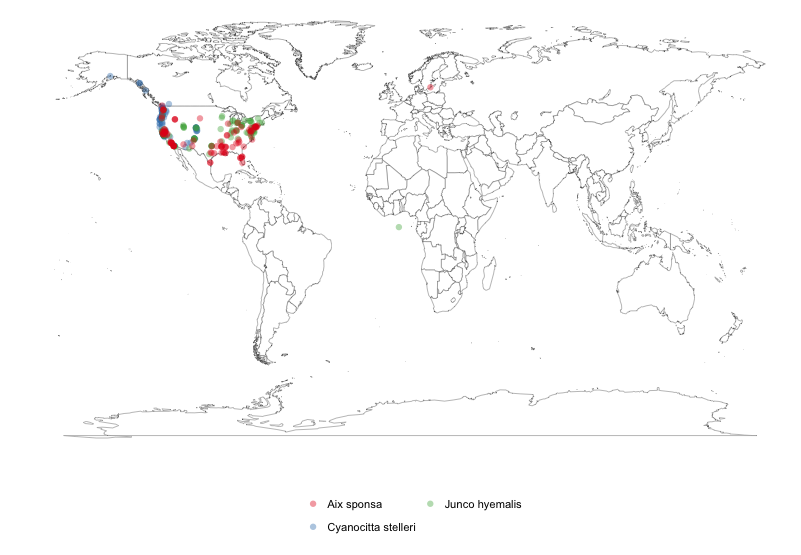

rgbif
=====

[](https://travis-ci.org/ropensci/rgbif)
<!-- dev branch [](https://travis-ci.org/ropensci/rgbif) -->

## About

This package gives you access to data from [GBIF](http://www.gbif.org/) via their REST API. GBIF versions their API - we are currently using `v1` of their API. Though you can still access their API of the form `http://data.gbif.org/ws/rest/...` through older functions - see `?rgbif-deprecated` and see below for a comparison between old and new.

Note that `rgbif` is being integrated with many other sources of species occurrence data in the package `spocc`. [Check it out](https://github.com/ropensci/spocc).

## Transitioning to the new GBIF API

+ The old GBIF API
	+ See documentation here: [http://data.gbif.org/tutorial/services](http://data.gbif.org/tutorial/services)
+ The new GBIF API
	+ See documentation here: [http://www.gbif.org/developer/summary](http://www.gbif.org/developer/summary)

The functions for the old GBIF API give deprecation messages, signaling that they are on their way out. A future version of `rgbif` will remove functions for the old API, so do transition to the functions for the new API soon.

The new GBIF API only uses JSON as a data format - no more XML. Of course this probably doesn't matter to you unless you are a hacker...

Changes in the new GBIF API from last with respect to `rgbif`:

| Function in old API | New API | Notes |
| ------ | ------- | ------ |
| rgb_country_codes | same | none |
| density_spplist | deprecated | service not provided anymore |
| densitylist | deprecated | service not provided anymore |
| gbifdata | deprecated | not needed |
| gbifmap_dens | deprecated | none |
| gbifmap_list | deprecated | none |
| is.gbifdens | deprecated | none |
| is.gbiflist | deprecated | none |
| networks | same | some parameters differ |
| occurrencecount | occ_count | some parameters differ |
| occurrencedensity | deprecated | service not provided anymore |
| occurrenceget | occ_get | none |
| occurrencelist | occ_search | none |
| occurrencelist_all | occ_search | none |
| occurrencelist_many | occ_search | none |
| providers | deprecated | see note 1 |
| resources | deprecated | see note 1 |
| stylegeojson | same | not implemented yet |
| taxoncount | deprecated | See ?occ_count |
| taxonget | deprecated | See ?name_lookup |
| taxonsearch | deprecated | See note 2 |
| taxrank | same | none |
| togeojson | same | not implemented yet |

* Note 1: See `?datasets`, `?networks`, `?nodes`, and `?organizations`.
* Note 2: See `?name_lookup` for names across all of GBIF and `name_backbone` for names only in the GBIF backbone taxonomy.

## Quick start

### Install stable version on CRAN

```coffee
install.packages("rgbif")
```

### Install development version

```coffee
install.packages("devtools")
library("devtools")

install_github("ropensci/rgbif")
library("rgbif")
```

Note: Windows users have to first install [Rtools](http://cran.r-project.org/bin/windows/Rtools/).

### Search for occurrence data

```coffee
occ_search(scientificName = "Ursus americanus")
```

```coffee
Records found [8330]
Records returned [20]
No. unique hierarchies [1]
No. media records [20]
Args [scientificName=Ursus americanus, limit=20, fields=minimal]
First 10 rows of data
               name       key decimalLatitude decimalLongitude
1  Ursus americanus 891034709        29.23322       -103.29468
2  Ursus americanus 891045574        43.73511        -72.52534
3  Ursus americanus 891041363        29.28284       -103.28908
4  Ursus americanus 891056344        29.27444       -103.31536
5  Ursus americanus 911496466        29.27817       -103.30167
6  Ursus americanus 911500351        37.39940        -79.98851
7  Ursus americanus 911503296        32.96132       -108.47295
8  Ursus americanus 911503052        37.79479       -119.86651
9  Ursus americanus 911501579        47.78411       -122.96344
10 Ursus americanus 911504089        38.74011        -78.30654
..              ...       ...             ...              ...
```

Or you can get the taxon key first with `name_backbone()`. Here, we select to only return the occurrence data.

```coffee
key <- name_backbone(name='Helianthus annuus', kingdom='plants')$speciesKey
occ_search(taxonKey=key, limit=20, return='data')
```

```coffee
                name  longitude latitude
1  Helianthus annuus   16.42280 56.57660
2  Helianthus annuus -116.99648 32.84967
3  Helianthus annuus   15.11370 56.22530
4  Helianthus annuus   15.85090 57.47840
5  Helianthus annuus   12.95860 57.72000
6  Helianthus annuus   15.50840 58.39800
7  Helianthus annuus   16.47670 56.65180
8  Helianthus annuus   14.61910 56.05580
9  Helianthus annuus   16.48530 58.60580
10 Helianthus annuus    3.58007 50.89776
11 Helianthus annuus    5.31755 51.05837
12 Helianthus annuus   15.55870 59.42630
13 Helianthus annuus   16.25400 56.67720
14 Helianthus annuus   15.50140 58.50290
15 Helianthus annuus   21.21820 64.90890
16 Helianthus annuus -118.22911 34.08994
17 Helianthus annuus   14.66350 58.23940
18 Helianthus annuus   16.42290 56.57660
19 Helianthus annuus   16.44190 58.60620
20 Helianthus annuus   16.41930 56.57470
```

#### Search for many species. Get the keys first with `name_backbone`, then pass to `occ_search`

```coffee
splist <- c('Accipiter erythronemius', 'Junco hyemalis', 'Aix sponsa')
keys <- sapply(splist, function(x) name_backbone(name=x)$speciesKey, USE.NAMES=FALSE)

occ_search(taxonKey=keys, limit=5, return='data', hasCoordinate=TRUE)

$`2480598`
                     name longitude   latitude
1 Accipiter erythronemius -60.73333   5.266667
2 Accipiter erythronemius -60.73333   5.266667
3 Accipiter erythronemius -60.73333   5.266667
4 Accipiter erythronemius -59.01670 -31.133300
5 Accipiter erythronemius -64.78353 -19.563531

$`2492010`
            name  longitude latitude
1 Junco hyemalis  -78.42087 38.16281
2 Junco hyemalis -116.84687 32.89224
3 Junco hyemalis -122.05739 36.95236
4 Junco hyemalis  -97.28027 32.88511
5 Junco hyemalis -111.82421 40.76623

$`2498387`
        name  longitude latitude
1 Aix sponsa -116.91708 32.85833
2 Aix sponsa  -81.90983 40.55409
3 Aix sponsa   16.37410 56.66830
4 Aix sponsa -120.47935 37.31153
5 Aix sponsa  -76.70940 38.74238
```

### Maps

#### Make a simple map of species occurrences.

```coffee
splist <- c('Cyanocitta stelleri', 'Junco hyemalis', 'Aix sponsa')
keys <- sapply(splist, function(x) name_backbone(name=x)$speciesKey, USE.NAMES=FALSE)
dat <- occ_search(taxonKey=keys, limit=100, return='data', hasCoordinate=TRUE)
library('plyr')
datdf <- ldply(dat)
gbifmap(datdf)
```



Please report any issues or bugs](https://github.com/ropensci/rgbif/issues).

License: CC0

This package is part of the [rOpenSci](http://ropensci.org/packages) project.

```coffee
To cite package ‘rgbif’ in publications use:

  Scott Chamberlain, Karthik Ram, Vijay Barve and Dan Mcglinn (2014). rgbif: Interface to the Global
  Biodiversity Information Facility API. R package version 0.7.0. https://github.com/ropensci/rgbif

A BibTeX entry for LaTeX users is

  @Manual{,
    title = {rgbif: Interface to the Global Biodiversity Information Facility API},
    author = {Scott Chamberlain and Karthik Ram and Vijay Barve and Dan Mcglinn},
    year = {2014},
    note = {R package version 0.7.0},
    url = {https://github.com/ropensci/rgbif},
  }
```

Get citation information for `rgbif` in R doing `citation(package = 'rgbif')`

<br>

[](http://ropensci.org)
