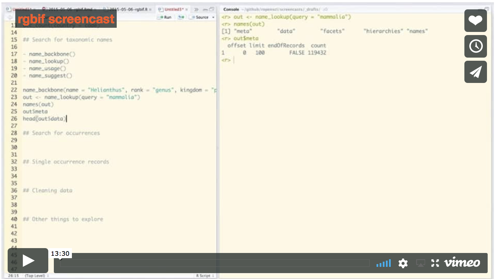

<!-- README.md is generated from README.Rmd. Please edit that file and knit -->


# rgbif 

[](https://www.repostatus.org/#active)
[](https://cranchecks.info/pkgs/rgbif)
[](https://travis-ci.org/ropensci/rgbif)
[](https://codecov.io/github/ropensci/rgbif?branch=master)
[](https://github.com/metacran/cranlogs.app)
[](https://cran.r-project.org/package=rgbif)
[](https://zenodo.org/badge/latestdoi/2273724)

`rgbif` gives you access to data from [GBIF][] via their REST API. GBIF versions their API - we are currently using `v1` of their API. You can no longer use their old API in this package - see `?rgbif-defunct`.

Maximum number of records you can get with `occ_search()` and `occ_data()` is 100,000. See https://www.gbif.org/developer/occurrence

To get started, see:

* rgbif vignette (https://docs.ropensci.org/rgbif/articles/rgbif.html): an introduction to the package's main functionalities.
* Function reference (https://docs.ropensci.org/rgbif/reference/index.html): an overview of all `rgbif` functions.
* Articles (https://docs.ropensci.org/rgbif/articles/index.html): vignettes/tutorials on how to download data, clean data, and work with taxonomic names.
* Occurrence manual (https://books.ropensci.org/occurrences/): a book covering a suite of R packages used for working with biological occurrence data.

Check out the `rgbif` [paper][] for more information on this package and the sister [Python][pygbif] and [Ruby][gbifrb] clients.

## Package API

The `rgbif` package API follows the GBIF API, which has the following sections:

* `registry` (<https://www.gbif.org/developer/registry>) - Metadata on datasets, and
contributing organizations, installations, networks, and nodes
    * `rgbif` functions: `dataset_metrics()`, `dataset_search()`, `dataset_suggest()`,
    `datasets()`, `enumeration()`, `enumeration_country()`, `installations()`, `networks()`,
    `nodes()`, `organizations()`
    * Registry also includes the GBIF OAI-PMH service, which includes GBIF registry
    data only. `rgbif` functions: `gbif_oai_get_records()`, `gbif_oai_identify()`,
    `gbif_oai_list_identifiers()`, `gbif_oai_list_metadataformats()`,
    `gbif_oai_list_records()`, `gbif_oai_list_sets()`
* `species` (<https://www.gbif.org/developer/species>) - Species names and metadata
    * `rgbif` functions: `name_backbone()`, `name_lookup()`, `name_suggest()`, `name_usage()`
* `occurrences` (<https://www.gbif.org/developer/occurrence>) - Occurrences, both for
the search and download APIs
    * `rgbif` functions: `occ_count()`, `occ_data()`, `occ_download()`, `occ_download_prep()`, `occ_download_queue()`, `occ_download_cancel()`,
    `occ_download_cancel_staged()`, `occ_download_get()`, `occ_download_import()`,
    `occ_download_list()`, `occ_download_meta()`, `occ_download_datasets()`, `occ_download_dataset_activity()`, `occ_get()`, `occ_issues()`,
    `occ_issues_lookup()`, `occ_metadata()`, `occ_search()`, `pred()`, `preds()`, `pred_multi()`
* `maps` (<https://www.gbif.org/developer/maps>) - Map API
    * `rgbif` functions: `map_fetch()`
    * Note: we used to have a function `gbifmap()` that used `ggplot2` to plot data from the
    occurrence API, but it's been removed - see package [mapr][]

## Installation


```r
install.packages("rgbif")
```

Or, install development version


```r
install.packages("remotes")
remotes::install_github("ropensci/rgbif")
```


```r
library("rgbif")
```

> Note: Windows users have to first install Rtools (https://cran.r-project.org/bin/windows/Rtools/) to use devtools

Mac Users:
(in case of errors)

Terminal:

Install gdal : https://github.com/edzer/sfr/blob/master/README.md#macos

```
brew install openssl
```

in R:


```r
install.packages('openssl')
install.packages('rgeos')
install.packages('rgbif')
```

## Search for occurrence data


```r
occ_search(scientificName = "Ursus americanus", limit = 50)
#> Records found [15793] 
#> Records returned [50] 
#> No. unique hierarchies [1] 
#> No. media records [50] 
#> No. facets [0] 
#> Args [limit=50, offset=0, scientificName=Ursus americanus, fields=all] 
#> # A tibble: 50 x 76
#>    key   scientificName decimalLatitude decimalLongitude issues datasetKey
#>    <chr> <chr>                    <dbl>            <dbl> <chr>  <chr>     
#>  1 2543… Ursus america…            42.5            -73.2 cdrou… 50c9509d-…
#>  2 2550… Ursus america…            35.7            -83.5 cdrou… 50c9509d-…
#>  3 2550… Ursus america…            31.3           -110.  cdrou… 50c9509d-…
#>  4 2550… Ursus america…            35.1           -118.  cdrou… 50c9509d-…
#>  5 2550… Ursus america…            25.2           -101.  cdrou… 50c9509d-…
#>  6 2550… Ursus america…            39.4           -120.  cdrou… 50c9509d-…
#>  7 2557… Ursus america…            43.8            -72.6 gass84 50c9509d-…
#>  8 2557… Ursus america…            34.0            -92.6 cdrou… 50c9509d-…
#>  9 2557… Ursus america…            34.0            -92.6 cdrou… 50c9509d-…
#> 10 2557… Ursus america…            34.0            -92.6 cdrou… 50c9509d-…
#> # … with 40 more rows, and 70 more variables: publishingOrgKey <chr>,
#> #   installationKey <chr>, publishingCountry <chr>, protocol <chr>,
#> #   lastCrawled <chr>, lastParsed <chr>, crawlId <int>, extensions <chr>,
#> #   basisOfRecord <chr>, taxonKey <int>, kingdomKey <int>, phylumKey <int>,
#> #   classKey <int>, orderKey <int>, familyKey <int>, genusKey <int>,
#> #   speciesKey <int>, acceptedTaxonKey <int>, acceptedScientificName <chr>,
#> #   kingdom <chr>, phylum <chr>, order <chr>, family <chr>, genus <chr>,
#> #   species <chr>, genericName <chr>, specificEpithet <chr>, taxonRank <chr>,
#> #   taxonomicStatus <chr>, dateIdentified <chr>,
#> #   coordinateUncertaintyInMeters <dbl>, stateProvince <chr>, year <int>,
#> #   month <int>, day <int>, eventDate <chr>, modified <chr>,
#> #   lastInterpreted <chr>, references <chr>, license <chr>, identifiers <chr>,
#> #   facts <chr>, relations <chr>, geodeticDatum <chr>, class <chr>,
#> #   countryCode <chr>, recordedByIDs <chr>, identifiedByIDs <chr>,
#> #   country <chr>, rightsHolder <chr>, identifier <chr>,
#> #   http...unknown.org.nick <chr>, verbatimEventDate <chr>, datasetName <chr>,
#> #   verbatimLocality <chr>, gbifID <chr>, collectionCode <chr>,
#> #   occurrenceID <chr>, taxonID <chr>, recordedBy <chr>, catalogNumber <chr>,
#> #   http...unknown.org.occurrenceDetails <chr>, institutionCode <chr>,
#> #   rights <chr>, eventTime <chr>, identificationID <chr>, name <chr>,
#> #   informationWithheld <chr>, occurrenceRemarks <chr>,
#> #   infraspecificEpithet <chr>
```

Or you can get the taxon key first with `name_backbone()`. Here, we select to only return the occurrence data.


```r
key <- name_backbone(name='Helianthus annuus', kingdom='plants')$speciesKey
occ_search(taxonKey=key, limit=20)
#> Records found [47227] 
#> Records returned [20] 
#> No. unique hierarchies [1] 
#> No. media records [20] 
#> No. facets [0] 
#> Args [limit=20, offset=0, taxonKey=9206251, fields=all] 
#> # A tibble: 20 x 90
#>    key   scientificName decimalLatitude decimalLongitude issues datasetKey
#>    <chr> <chr>                    <dbl>            <dbl> <chr>  <chr>     
#>  1 2542… Helianthus an…            25.8           -100.  cdrou… 50c9509d-…
#>  2 2550… Helianthus an…            25.6           -100.  cdrou… 50c9509d-…
#>  3 2550… Helianthus an…            25.8           -101.  cdrou… 50c9509d-…
#>  4 2557… Helianthus an…            18.6            -99.2 cdrou… 50c9509d-…
#>  5 2557… Helianthus an…            26.9           -101.  cdrou… 50c9509d-…
#>  6 2558… Helianthus an…            59.8             17.6 cdrou… 38b4c89f-…
#>  7 2561… Helianthus an…            59.8             17.6 cdrou… 38b4c89f-…
#>  8 2563… Helianthus an…            33.6           -112.  cdrou… 50c9509d-…
#>  9 2579… Helianthus an…            33.6           -118.  cdrou… 50c9509d-…
#> 10 2564… Helianthus an…            59.6             17.4 gass84 38b4c89f-…
#> 11 2572… Helianthus an…            56.2             12.6 gass84 38b4c89f-…
#> 12 2572… Helianthus an…            59.8             17.6 gass84 38b4c89f-…
#> 13 2573… Helianthus an…            33.2           -112.  cdrou… 50c9509d-…
#> 14 2573… Helianthus an…            26.3            -98.2 cdrou… 50c9509d-…
#> 15 2573… Helianthus an…            21.9           -102.  cdrou… 50c9509d-…
#> 16 2574… Helianthus an…            30.3            -97.7 cdrou… 50c9509d-…
#> 17 2576… Helianthus an…           -26.3             27.0 cdrou… 50c9509d-…
#> 18 2576… Helianthus an…            29.6            -95.5 cdrou… 50c9509d-…
#> 19 2576… Helianthus an…            34.1           -117.  cdrou… 50c9509d-…
#> 20 2576… Helianthus an…            25.1           -108.  cdrou… 50c9509d-…
#> # … with 84 more variables: publishingOrgKey <chr>, installationKey <chr>,
#> #   publishingCountry <chr>, protocol <chr>, lastCrawled <chr>,
#> #   lastParsed <chr>, crawlId <int>, extensions <chr>, basisOfRecord <chr>,
#> #   taxonKey <int>, kingdomKey <int>, phylumKey <int>, classKey <int>,
#> #   orderKey <int>, familyKey <int>, genusKey <int>, speciesKey <int>,
#> #   acceptedTaxonKey <int>, acceptedScientificName <chr>, kingdom <chr>,
#> #   phylum <chr>, order <chr>, family <chr>, genus <chr>, species <chr>,
#> #   genericName <chr>, specificEpithet <chr>, taxonRank <chr>,
#> #   taxonomicStatus <chr>, dateIdentified <chr>, stateProvince <chr>,
#> #   year <int>, month <int>, day <int>, eventDate <chr>, modified <chr>,
#> #   lastInterpreted <chr>, references <chr>, license <chr>, identifiers <chr>,
#> #   facts <chr>, relations <chr>, geodeticDatum <chr>, class <chr>,
#> #   countryCode <chr>, recordedByIDs <chr>, identifiedByIDs <chr>,
#> #   country <chr>, rightsHolder <chr>, identifier <chr>,
#> #   http...unknown.org.nick <chr>, verbatimEventDate <chr>, datasetName <chr>,
#> #   verbatimLocality <chr>, gbifID <chr>, collectionCode <chr>,
#> #   occurrenceID <chr>, taxonID <chr>, recordedBy <chr>, catalogNumber <chr>,
#> #   http...unknown.org.occurrenceDetails <chr>, institutionCode <chr>,
#> #   rights <chr>, eventTime <chr>, identificationID <chr>, name <chr>,
#> #   coordinateUncertaintyInMeters <dbl>, continent <chr>, municipality <chr>,
#> #   county <chr>, identificationVerificationStatus <chr>, language <chr>,
#> #   type <chr>, occurrenceStatus <chr>, vernacularName <chr>,
#> #   taxonConceptID <chr>, informationWithheld <chr>, endDayOfYear <chr>,
#> #   locality <chr>, startDayOfYear <chr>, datasetID <chr>, accessRights <chr>,
#> #   higherClassification <chr>, occurrenceRemarks <chr>
```

## Search for many species

Get the keys first with `name_backbone()`, then pass to `occ_search()`


```r
splist <- c('Accipiter erythronemius', 'Junco hyemalis', 'Aix sponsa')
keys <- sapply(splist, function(x) name_backbone(name=x)$speciesKey, USE.NAMES=FALSE)
occ_search(taxonKey=keys, limit=5, hasCoordinate=TRUE)
#> Records found [2480598 (39), 9362842 (5533951), 2498387 (1830337)] 
#> Records returned [2480598 (5), 9362842 (5), 2498387 (5)] 
#> No. unique hierarchies [2480598 (1), 9362842 (1), 2498387 (1)] 
#> No. media records [2480598 (5), 9362842 (5), 2498387 (5)] 
#> No. facets [2480598 (0), 9362842 (0), 2498387 (0)] 
#> Args [hasCoordinate=TRUE, limit=5, offset=0, taxonKey=2480598,9362842,2498387,
#>      fields=all] 
#> 3 requests; First 10 rows of data from 2480598
#> 
#> # A tibble: 5 x 68
#>   key   scientificName decimalLatitude decimalLongitude issues datasetKey
#>   <chr> <chr>                    <dbl>            <dbl> <chr>  <chr>     
#> 1 2243… Accipiter ery…           -38.3            -60.4 ""     b1047888-…
#> 2 2432… Accipiter ery…           -24.0            -52.2 ""     b1047888-…
#> 3 2609… Accipiter ery…           -26.6            -53.8 ""     b1047888-…
#> 4 2609… Accipiter ery…           -26.6            -53.8 ""     b1047888-…
#> 5 2609… Accipiter ery…           -26.6            -53.8 ""     b1047888-…
#> # … with 62 more variables: publishingOrgKey <chr>, installationKey <chr>,
#> #   publishingCountry <chr>, protocol <chr>, lastCrawled <chr>,
#> #   lastParsed <chr>, crawlId <int>, extensions <chr>, basisOfRecord <chr>,
#> #   taxonKey <int>, kingdomKey <int>, phylumKey <int>, classKey <int>,
#> #   orderKey <int>, familyKey <int>, genusKey <int>, speciesKey <int>,
#> #   acceptedTaxonKey <int>, acceptedScientificName <chr>, kingdom <chr>,
#> #   phylum <chr>, order <chr>, family <chr>, genus <chr>, species <chr>,
#> #   genericName <chr>, specificEpithet <chr>, taxonRank <chr>,
#> #   taxonomicStatus <chr>, year <int>, month <int>, day <int>, eventDate <chr>,
#> #   lastInterpreted <chr>, references <chr>, license <chr>, identifiers <chr>,
#> #   facts <chr>, relations <chr>, geodeticDatum <chr>, class <chr>,
#> #   countryCode <chr>, recordedByIDs <chr>, identifiedByIDs <chr>,
#> #   country <chr>, rightsHolder <chr>, identifier <chr>,
#> #   verbatimEventDate <chr>, nomenclaturalCode <chr>, locality <chr>,
#> #   gbifID <chr>, collectionCode <chr>, occurrenceID <chr>, recordedBy <chr>,
#> #   catalogNumber <chr>, vernacularName <chr>, fieldNotes <chr>,
#> #   eventTime <chr>, verbatimElevation <chr>, behavior <chr>,
#> #   higherClassification <chr>, name <chr>
```

## Maps

We've removed `gbifmap()` which helped users plot data from functions `occ_search()`/`occ_data()` - instead we strongly recommend using our other package [mapr][].

As of `rgibf v1`, we have integration for GBIF's mapping API, which lets you get raster images of
occurrences of taxa of interest. For example:


```r
x <- map_fetch(taxonKey = 3118771, year = 2010)
x
#> class      : RasterLayer 
#> dimensions : 512, 512, 262144  (nrow, ncol, ncell)
#> resolution : 0.703125, 0.3515625  (x, y)
#> extent     : -180, 180, -90, 90  (xmin, xmax, ymin, ymax)
#> crs        : +init=epsg:4326 +proj=longlat +datum=WGS84 +no_defs +ellps=WGS84 +towgs84=0,0,0 
#> source     : memory
#> names      : layer 
#> values     : 0, 1  (min, max)
```


```r
library(raster)
plot(x, axes = FALSE, box = FALSE)
```


## Screencast

<a href="https://vimeo.com/127119010"></a>


## Meta

* Please [report any issues or bugs](https://github.com/ropensci/rgbif/issues).
* License: MIT
* Get citation information for `rgbif` in R doing `citation(package = 'rgbif')`
* Please note that this project is released with a [Contributor Code of Conduct][coc].
By participating in this project you agree to abide by its terms.

- - -

This package is part of a richer suite called [spocc - Species Occurrence Data](https://github.com/ropensci/spocc), along with several other packages, that provide access to occurrence records from multiple databases.

- - -

[](https://ropensci.org)

[mapr]: https://github.com/ropensci/mapr
[paper]: https://peerj.com/preprints/3304/
[GBIF]: https://www.gbif.org/
[pygbif]: https://github.com/sckott/pygbif
[gbifrb]: https://github.com/sckott/gbifrb
[coc]: https://github.com/ropensci/rgbif/blob/master/.github/CODE_OF_CONDUCT.md
