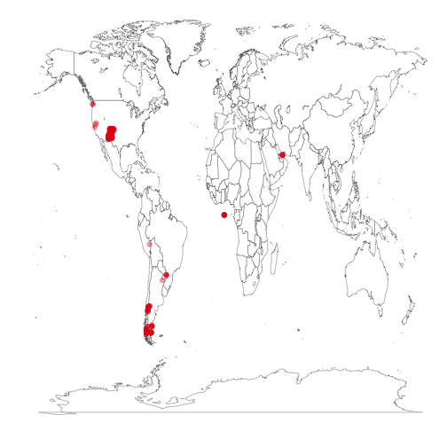
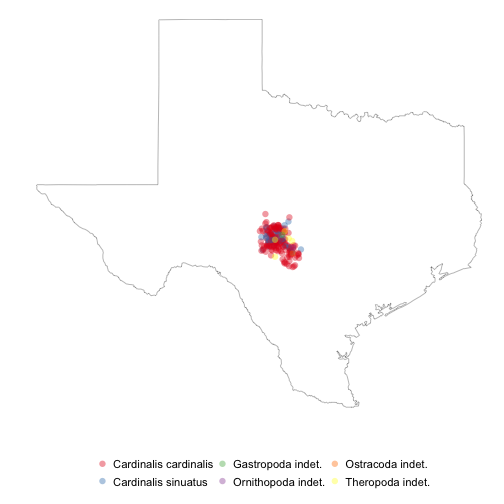

<!--
%\VignetteEngine{knitr}
%\VignetteIndexEntry{An R Markdown Vignette made with knitr}
-->

rgbif vignette - Seach and retrieve data from the Global Biodiverity Information Facilty (GBIF)
======

### About the package

`rgbif` is an R package to search and retrieve data from the Global Biodiverity Information Facilty (GBIF). `rgbif` wraps R code around the [GBIF API][gbifapi] to allow you to talk to the BISON database from R. 

********************

#### Install rgbif


```r
# install.packages('devtools'); library(devtools);
# install_github('rbison', 'ropensci')
library(rgbif)
library(XML)
library(RCurl)
```

```
Loading required package: bitops
```

```r
library(plyr)
library(ggplot2)
library(maps)
```


********************

#### Get a list of the data networks in GBIF - and you can use the networkkey number to seach for occurrences for the specific provider in other functions


```r
# Test the function for a few networks
networks(maxresults = 5)
```

```
                                           names_ networkkey
1 Biological Collection Access Service for Europe          4
2                                         HerpNET          6
3             Mammal Networked Information System          1
4          Ocean Biogeographic Information System          3
5                         Plant Genetic Resources          2
```

```r

# By name
networks("ORNIS")
```

```
        names_ networkkey
gbifKey  ORNIS          8
```


********************

#### Get a list of the data providers in GBIF - and you can use the dataproviderkey number to seach for occurrences for the specific provider in other functions


```r
# Test the function for a few providers
providers(maxresults = 5)
```

```
                                                             names_
1                                          Białowieża National Park
2                                 Borror Laboratory of Bioacoustics
3                                                    Index Fungorum
4 Leibniz Institute of Plant Genetics and Crop Plant Research (IPK)
5       National Museum of Natural History, Smithsonian Institution
  dataproviderkey
1             219
2             221
3             223
4             222
5             220
```

```r

# By data provider name
providers("University of Texas-Austin")
```

```
                            names_ dataproviderkey
gbifKey University of Texas-Austin             192
```


********************

#### Get a list of the data resources in GBIF - and you can use the resourcekey number to seach for occurrences for the specific resource in other functions


```r
# Test the function for a few resources
resources(maxresults = 5)
```

```
                         names_ resourcekey
1                          IPNI          40
2                         eBird          43
3 Macaulay Library - Audio Data          41
4 Macaulay Library - Video Data          42
5        GBIF Backbone Taxonomy           1
```

```r

# By name
head(resources("Flora"))
```

```
                                                                                                                                         names_
1                                                                                                                              Flora Costa Rica
2                                                                                                              Flora of Japan Specimen Database
3                                                                                                                     Flora of the Stołowe Mts.
4                                                                                                                      Flora Mycologica Iberica
5                                                                                                                   Flora acuática de Querétaro
6 Flora acuática vascular de las regiones hidrológicas R66 (Lagos Cráter del Nevado de Toluca) y R67 (Río Amacuzac-Lagunas de Zempoala), México
  resourcekey
1        8134
2       14644
3       11324
4         252
5       13190
6       13193
```


********************

#### Get number of occurrences for a set of search parameters

```r
occurrencecount(scientificname = "Accipiter erythronemius", coordinatestatus = TRUE)
```

```
[1] 10
```

```r
occurrencecount(scientificname = "Helianthus annuus", coordinatestatus = TRUE, 
    year = 2005, maxlatitude = 20)
```

```
[1] 140
```


********************

#### Get possible values to be used in taxonomic rank arguments in functions


```r
taxrank()
```

```
[1] "kingdom"       "phylum"        "class"         "order"        
[5] "family"        "genus"         "species"       "infraspecific"
```


********************

#### Seach by taxon to retrieve number of records per taxon found in GBIF

```r
taxoncount(scientificname = "Puma concolor")
```

```
[1] 90
```

```r
taxoncount(scientificname = "Helianthus annuus")
```

```
[1] 141
```

```r
taxoncount(rank = "family")
```

```
[1] 477094
```


********************

#### Get taxonomic information on a specific taxon or taxa in GBIF by their taxon concept keys


```r
(out <- taxonsearch(scientificname = "Puma concolor"))
```

```
  gbifkey   status          name    rank  sci                 source
1 2435099 accepted Puma concolor species true GBIF Backbone Taxonomy
  primary
1    true
```


********************

#### Search for taxa in GBIF


```r
taxonsearch(scientificname = "Puma concolor", rank = "species", maxresults = 10)
```

```
  gbifkey   status          name    rank  sci                 source
1 2435099 accepted Puma concolor species true GBIF Backbone Taxonomy
  primary
1    true
```

```r
taxonsearch(scientificname = "Puma concolor", rank = "species", dataproviderkey = 1)
```

```
  gbifkey   status          name    rank  sci                 source
1 2435099 accepted Puma concolor species true GBIF Backbone Taxonomy
  primary
1    true
```


********************

#### Get data for a single occurrence. Note that data is returned as a list, so you have to convert to a data.frame, etc. as you wish

```r
occurrenceget(key = 13749100)$dataProvider$dataResources$dataResource$occurrenceRecords$TaxonOccurrence[1:10]
```

```
$catalogNumber
[1] "1687588"

$collectionCode
[1] "Biologiezentrum Linz"

$coordinateUncertaintyInMeters
[1] "500"

$country
[1] "AUT"

$decimalLatitude
[1] "47.81"

$decimalLongitude
[1] "13.98"

$institutionCode
[1] "LI"

$minimumElevationInMeters
[1] "1506"

$earliestDateCollected
[1] "1947-09-27"

$latestDateCollected
[1] "1947-09-27"
```


********************


```r
out <- occurrencelist(scientificname = "Puma concolor", coordinatestatus = TRUE, 
    maxresults = 20)
```


Note that the default object printed from a call to `occurrencelist` is a list that contains:

+ NumberFound: number of occurrences found in search results.
+ TaxonNames: Unique list of taxonomic names in search results.
+ Coordinates: Min and max latitude and longitude of all occurrences.
+ Countries: Countries contained in results set.


```r
out
```

```
$NumberFound
[1] 20

$TaxonNames
[1] "PUMA CONCOLOR"     "PUMA ? CONCOLOR ?"

$Coordinates
         Stats  numbers
1  MinLatitude    2.583
2  MaxLatitude   49.683
3 MinLongitude -126.617
4 MaxLongitude  -59.249

$Countries
[1] "CANADA" "GUYANA"
```


Where do you get data after a call to the `occurrencelist` function? This is where `gbifdata` comes in. By default a call to `gbifdata` prints a minimal data.frame with just rows *name*, *latitude*, and *longitude*.


```r
gbifdata(out)
```

```
           taxonName decimalLatitude decimalLongitude
1      Puma concolor          49.017          -122.78
2      Puma concolor           6.317           -60.27
3      Puma concolor          49.683          -125.05
4      Puma concolor           6.317           -60.27
5      Puma concolor           2.833           -59.52
6      Puma concolor           2.833           -59.52
7      Puma concolor           2.945           -59.25
8      Puma concolor           2.833           -59.52
9      Puma concolor           3.091           -59.26
10     Puma concolor          45.383           -71.90
11 Puma ? concolor ?          45.850           -66.23
12     Puma concolor          49.600          -126.57
13     Puma concolor           2.833           -59.52
14     Puma concolor          49.017          -122.78
15     Puma concolor           2.583           -59.93
16     Puma concolor           2.833           -59.52
17     Puma concolor           2.833           -59.52
18     Puma concolor           6.317           -60.27
19     Puma concolor           2.833           -59.52
20     Puma concolor          49.600          -126.62
```


Though you can get more detailed data by calling *minimal=FALSE*.


```r
head(gbifdata(out, minimal = FALSE)[, 1:6])
```

```
      taxonName country decimalLatitude decimalLongitude catalogNumber
1 Puma concolor  CANADA          49.017          -122.78    3502070001
2 Puma concolor  GUYANA           6.317           -60.27         34302
3 Puma concolor  CANADA          49.683          -125.05         27564
4 Puma concolor  GUYANA           6.317           -60.27         34303
5 Puma concolor  GUYANA           2.833           -59.52         32266
6 Puma concolor  GUYANA           2.833           -59.52         32234
  earliestDateCollected
1                  <NA>
2                  <NA>
3                  <NA>
4                  <NA>
5                  <NA>
6                  <NA>
```


And you can get all possible data by specifying *format=darwin*.


```r
out <- occurrencelist(scientificname = "Puma concolor", coordinatestatus = TRUE, 
    format = "darwin", maxresults = 20)
head(gbifdata(out, minimal = FALSE)[, 1:6])
```

```
          taxonName country                stateProvince  county
1     Puma concolor  CANADA             BRITISH COLUMBIA    <NA>
2     Puma concolor  GUYANA UPPER TAKUTU-UPPER ESSEQUIBO    <NA>
3     Puma concolor  CANADA             BRITISH COLUMBIA    <NA>
4 Puma ? concolor ?  CANADA                NEW BRUNSWICK SUNBURY
5     Puma concolor  CANADA             BRITISH COLUMBIA    <NA>
6     Puma concolor  GUYANA UPPER TAKUTU-UPPER ESSEQUIBO    <NA>
        locality decimalLatitude
1 CAMPBELL RIVER          49.017
2           <NA>           6.317
3           <NA>          49.600
4           <NA>          45.850
5           <NA>          49.683
6           <NA>           3.091
```


********************

#### Maps


```r
splist <- c("Accipiter erythronemius", "Junco hyemalis", "Aix sponsa", "Ceyx fallax", 
    "Picoides lignarius", "Campephilus leucopogon")
out <- occurrencelist_many(splist, coordinatestatus = TRUE, maxresults = 20)
gbifmap_list(out)
```

```
Rendering map...plotting 99 points
```

 


Another example, setting scientificname="*" so we just get any species, and then mapping points only within the state of Texas in the US.


```r
out <- occurrencelist(scientificname = "*", minlatitude = 30, maxlatitude = 35, 
    minlongitude = -100, maxlongitude = -95, coordinatestatus = TRUE, maxresults = 200)
gbifmap_list(input = out, mapdatabase = "state", region = "texas", geom = geom_jitter, 
    jitter = position_jitter(width = 0.3, height = 0.3))
```

```
Rendering map...plotting 199 points
```

 


********************

[gbifapi]: http://data.gbif.org/tutorial/services
