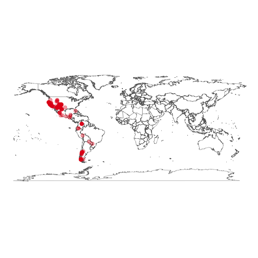

<!--
%\VignetteEngine{knitr::knitr}
%\VignetteIndexEntry{rgbif introduction}
%\VignetteEncoding{UTF-8}
-->


rgbif introduction
======

Seach and retrieve data from the Global Biodiverity Information Facilty (GBIF)

## About the package

`rgbif` is an R package to search and retrieve data from the Global Biodiverity Information Facilty (GBIF). `rgbif` wraps R code around the [GBIF API][gbifapi] to allow you to talk to GBIF from R.


## Get rgbif

Install from CRAN


```r
install.packages("rgbif")
```

Or install the development version from GitHub


```r
devtools::install_github("ropensci/rgbif")
```

Load rgbif


```r
library("rgbif")
```

## Number of occurrences

Search by type of record, all observational in this case


```r
occ_count(basisOfRecord='OBSERVATION')
#> [1] 100714177
```

Records for **Puma concolor** with lat/long data (georeferened) only. Note that `hasCoordinate` in `occ_search()` is the same as `georeferenced` in `occ_count()`.


```r
occ_count(taxonKey=2435099, georeferenced=TRUE)
#> [1] 2833
```

All georeferenced records in GBIF


```r
occ_count(georeferenced=TRUE)
#> [1] 471048856
```

Records from Denmark


```r
denmark_code <- isocodes[grep("Denmark", isocodes$name), "code"]
occ_count(country=denmark_code)
#> [1] 9617238
```

Number of records in a particular dataset


```r
occ_count(datasetKey='9e7ea106-0bf8-4087-bb61-dfe4f29e0f17')
#> [1] 4591
```

All records from 2012


```r
occ_count(year=2012)
#> [1] 37859753
```

Records for a particular dataset, and only for preserved specimens


```r
occ_count(datasetKey='e707e6da-e143-445d-b41d-529c4a777e8b', basisOfRecord='OBSERVATION')
#> [1] 2120907
```

## Search for taxon names

Get possible values to be used in taxonomic rank arguments in functions


```r
taxrank()
#> [1] "kingdom"       "phylum"        "class"         "order"        
#> [5] "family"        "genus"         "species"       "infraspecific"
```

`name_lookup()` does full text search of name usages covering the scientific and vernacular name, the species description, distribution and the entire classification across all name usages of all or some checklists. Results are ordered by relevance as this search usually returns a lot of results.

By default `name_lookup()` returns five slots of information: meta, data, facets, hierarchies, and names. hierarchies and names elements are named by their matching GBIF key in the `data.frame` in the data slot.


```r
out <- name_lookup(query='mammalia')
```


```r
names(out)
#> [1] "meta"        "data"        "facets"      "hierarchies" "names"
```


```r
out$meta
#>   offset limit endOfRecords  count
#> 1      0   100        FALSE 120067
```


```r
head(out$data)
#>         key          scientificName                           datasetKey
#> 1 125798198                Mammalia 16c3f9cb-4b19-4553-ac8e-ebb90003aa02
#> 2 116665331 Mammalia Linnaeus, 1758 cbb6498e-8927-405a-916b-576d00a6289b
#> 3       359 Mammalia Linnaeus, 1758 d7dddbf4-2cf0-4f39-9b2a-bb099caae36c
#> 4 125826646 Mammalia Linnaeus, 1758 16c3f9cb-4b19-4553-ac8e-ebb90003aa02
#> 5 143044906                Mammalia cbb6498e-8927-405a-916b-576d00a6289b
#> 6 102402290                Mammalia 0938172b-2086-439c-a1dd-c21cb0109ed5
#>   nubKey parentKey        parent   phylum phylumKey  classKey
#> 1    359 137006861      Chordata Chordata 137006861 125798198
#> 2    359 143035196      Chordata Chordata 143035196 116665331
#> 3    359        44      Chordata Chordata        44       359
#> 4    359 137006861      Chordata Chordata 137006861 125826646
#> 5    359 143044905 Macroscelidea Chordata 143035196 143044905
#> 6    359 102545028      Chordata Chordata 102545028 102402290
#>   canonicalName     authorship   nameType  rank numDescendants
#> 1      Mammalia                WELLFORMED CLASS              2
#> 2      Mammalia Linnaeus, 1758 WELLFORMED CLASS           1193
#> 3      Mammalia Linnaeus, 1758 WELLFORMED CLASS          30001
#> 4      Mammalia Linnaeus, 1758 WELLFORMED CLASS              0
#> 5      Mammalia                WELLFORMED ORDER              3
#> 6      Mammalia                WELLFORMED CLASS          15187
#>   numOccurrences   taxonID extinct habitats nomenclaturalStatus
#> 1              0   2621711    TRUE     <NA>                  NA
#> 2              0     18838      NA     <NA>                  NA
#> 3              0 119459549   FALSE   MARINE                  NA
#> 4              0      7907      NA     <NA>                  NA
#> 5              0      <NA>      NA     <NA>                  NA
#> 6              0      1310      NA     <NA>                  NA
#>   threatStatuses synonym         class  kingdom kingdomKey
#> 1             NA   FALSE      Mammalia     <NA>         NA
#> 2             NA   FALSE      Mammalia Animalia  116630539
#> 3             NA   FALSE      Mammalia Animalia          1
#> 4             NA   FALSE      Mammalia     <NA>         NA
#> 5             NA   FALSE Macroscelidea Animalia  116630539
#> 6             NA   FALSE      Mammalia Animalia  101719444
#>                                                                                                                                                                                                                      publishedIn
#> 1                                                                                                                                                                                                                           <NA>
#> 2                                                                                                                                                                                                                           <NA>
#> 3 Linnaeus, C. (1758). Systema Naturae per regna tria naturae, secundum classes, ordines, genera, species, cum characteribus, differentiis, synonymis, locis. Editio decima, reformata. Laurentius Salvius: Holmiae. ii, 824 pp.
#> 4                                                                                                                                                                                                                           <NA>
#> 5                                                                                                                                                                                                                           <NA>
#> 6                                                                                                                                                                                                                           <NA>
#>                               accordingTo taxonomicStatus    order
#> 1                                    <NA>            <NA>     <NA>
#> 2                                    <NA>            <NA>     <NA>
#> 3 The Catalogue of Life, 3rd January 2011        ACCEPTED     <NA>
#> 4                                    <NA>            <NA>     <NA>
#> 5                                    <NA>        ACCEPTED Mammalia
#> 6                                    <NA>            <NA>     <NA>
#>    orderKey species speciesKey acceptedKey accepted family familyKey genus
#> 1        NA    <NA>         NA          NA     <NA>   <NA>        NA  <NA>
#> 2        NA    <NA>         NA          NA     <NA>   <NA>        NA  <NA>
#> 3        NA    <NA>         NA          NA     <NA>   <NA>        NA  <NA>
#> 4        NA    <NA>         NA          NA     <NA>   <NA>        NA  <NA>
#> 5 143044906    <NA>         NA          NA     <NA>   <NA>        NA  <NA>
#> 6        NA    <NA>         NA          NA     <NA>   <NA>        NA  <NA>
#>   genusKey
#> 1       NA
#> 2       NA
#> 3       NA
#> 4       NA
#> 5       NA
#> 6       NA
```


```r
out$facets
#> NULL
```


```r
out$hierarchies[1:2]
#> $`125798198`
#>     rankkey     name
#> 1 137006861 Chordata
#> 
#> $`116665331`
#>     rankkey     name
#> 1 116630539 Animalia
#> 2 143035196 Chordata
```


```r
out$names[2]
#> $`116665331`
#>   vernacularName language
#> 1        Mammals      eng
```

Search for a genus


```r
head(name_lookup(query='Cnaemidophorus', rank="genus", return="data"))
#>         key                  scientificName
#> 1 116755723 Cnaemidophorus Wallengren, 1862
#> 2   1858636 Cnaemidophorus Wallengren, 1862
#> 3 125802004 Cnaemidophorus Wallengren, 1862
#> 4 141163021                  Cnaemidophorus
#> 5 143026572                  Cnaemidophorus
#> 6 143105347                  Cnaemidophorus
#>                             datasetKey  nubKey parentKey        parent
#> 1 cbb6498e-8927-405a-916b-576d00a6289b 1858636 143026560 Pterophoridae
#> 2 d7dddbf4-2cf0-4f39-9b2a-bb099caae36c 1858636      8863 Pterophoridae
#> 3 16c3f9cb-4b19-4553-ac8e-ebb90003aa02 1858636 125793784 Pterophoridae
#> 4 7ddf754f-d193-4cc9-b351-99906754a03b 1858636 141163009 Pterophoridae
#> 5 cbb6498e-8927-405a-916b-576d00a6289b 1858636 143026560 Pterophoridae
#> 6 de8934f4-a136-481c-a87a-b0b202b80a31 1858636 143105341 Pterophoridae
#>    kingdom     phylum       order        family          genus kingdomKey
#> 1 Animalia Arthropoda Lepidoptera Pterophoridae Cnaemidophorus  116630539
#> 2 Animalia Arthropoda Lepidoptera Pterophoridae Cnaemidophorus          1
#> 3     <NA>       <NA> Lepidoptera Pterophoridae Cnaemidophorus         NA
#> 4 Animalia Arthropoda Lepidoptera Pterophoridae Cnaemidophorus  140821094
#> 5 Animalia Arthropoda Lepidoptera Pterophoridae Cnaemidophorus  116630539
#> 6 Animalia Arthropoda Lepidoptera Pterophoridae Cnaemidophorus  115107543
#>   phylumKey  classKey  orderKey familyKey  genusKey  canonicalName
#> 1 142985476 142986985 143005160 143026560 116755723 Cnaemidophorus
#> 2        54       216       797      8863   1858636 Cnaemidophorus
#> 3        NA 137009267 125810165 125793784 125802004 Cnaemidophorus
#> 4 140844030 140891424 141139334 141163009 141163021 Cnaemidophorus
#> 5 142985476 142986985 143005160 143026560 143026572 Cnaemidophorus
#> 6 143098345 143099231 143104597 143105341 143105347 Cnaemidophorus
#>         authorship   nameType  rank numDescendants numOccurrences
#> 1 Wallengren, 1862 WELLFORMED GENUS              2              0
#> 2 Wallengren, 1862 WELLFORMED GENUS              4              0
#> 3 Wallengren, 1862 WELLFORMED GENUS              1              0
#> 4                  WELLFORMED GENUS              2              0
#> 5                  WELLFORMED GENUS              2              0
#> 6                  WELLFORMED GENUS              1              0
#>     taxonID habitats nomenclaturalStatus threatStatuses synonym   class
#> 1  29079847       NA                  NA             NA   FALSE Insecta
#> 2 115123697       NA                  NA             NA   FALSE Insecta
#> 3   3502919       NA                  NA             NA   FALSE Insecta
#> 4  21949965       NA                  NA             NA   FALSE Insecta
#> 5      <NA>       NA                  NA             NA   FALSE Insecta
#> 6      <NA>       NA                  NA             NA   FALSE Insecta
#>                                               publishedIn    accordingTo
#> 1                                                    <NA>           <NA>
#> 2 K. svenska VetenskAkad. Handl. , (N. F. ) 3, no. 7, 10. Fauna Europaea
#> 3                                                    <NA>           <NA>
#> 4                                                    <NA>           <NA>
#> 5                                                    <NA>           <NA>
#> 6                                                    <NA>           <NA>
#>   taxonomicStatus extinct acceptedKey accepted
#> 1            <NA>      NA          NA     <NA>
#> 2        ACCEPTED   FALSE          NA     <NA>
#> 3            <NA>      NA          NA     <NA>
#> 4            <NA>      NA          NA     <NA>
#> 5        ACCEPTED      NA          NA     <NA>
#> 6        ACCEPTED      NA          NA     <NA>
```

Search for the class mammalia


```r
head(name_lookup(query='mammalia', return = 'data'))
#>         key          scientificName                           datasetKey
#> 1 125798198                Mammalia 16c3f9cb-4b19-4553-ac8e-ebb90003aa02
#> 2 116665331 Mammalia Linnaeus, 1758 cbb6498e-8927-405a-916b-576d00a6289b
#> 3       359 Mammalia Linnaeus, 1758 d7dddbf4-2cf0-4f39-9b2a-bb099caae36c
#> 4 125826646 Mammalia Linnaeus, 1758 16c3f9cb-4b19-4553-ac8e-ebb90003aa02
#> 5 143044906                Mammalia cbb6498e-8927-405a-916b-576d00a6289b
#> 6 102402290                Mammalia 0938172b-2086-439c-a1dd-c21cb0109ed5
#>   nubKey parentKey        parent   phylum phylumKey  classKey
#> 1    359 137006861      Chordata Chordata 137006861 125798198
#> 2    359 143035196      Chordata Chordata 143035196 116665331
#> 3    359        44      Chordata Chordata        44       359
#> 4    359 137006861      Chordata Chordata 137006861 125826646
#> 5    359 143044905 Macroscelidea Chordata 143035196 143044905
#> 6    359 102545028      Chordata Chordata 102545028 102402290
#>   canonicalName     authorship   nameType  rank numDescendants
#> 1      Mammalia                WELLFORMED CLASS              2
#> 2      Mammalia Linnaeus, 1758 WELLFORMED CLASS           1193
#> 3      Mammalia Linnaeus, 1758 WELLFORMED CLASS          30001
#> 4      Mammalia Linnaeus, 1758 WELLFORMED CLASS              0
#> 5      Mammalia                WELLFORMED ORDER              3
#> 6      Mammalia                WELLFORMED CLASS          15187
#>   numOccurrences   taxonID extinct habitats nomenclaturalStatus
#> 1              0   2621711    TRUE     <NA>                  NA
#> 2              0     18838      NA     <NA>                  NA
#> 3              0 119459549   FALSE   MARINE                  NA
#> 4              0      7907      NA     <NA>                  NA
#> 5              0      <NA>      NA     <NA>                  NA
#> 6              0      1310      NA     <NA>                  NA
#>   threatStatuses synonym         class  kingdom kingdomKey
#> 1             NA   FALSE      Mammalia     <NA>         NA
#> 2             NA   FALSE      Mammalia Animalia  116630539
#> 3             NA   FALSE      Mammalia Animalia          1
#> 4             NA   FALSE      Mammalia     <NA>         NA
#> 5             NA   FALSE Macroscelidea Animalia  116630539
#> 6             NA   FALSE      Mammalia Animalia  101719444
#>                                                                                                                                                                                                                      publishedIn
#> 1                                                                                                                                                                                                                           <NA>
#> 2                                                                                                                                                                                                                           <NA>
#> 3 Linnaeus, C. (1758). Systema Naturae per regna tria naturae, secundum classes, ordines, genera, species, cum characteribus, differentiis, synonymis, locis. Editio decima, reformata. Laurentius Salvius: Holmiae. ii, 824 pp.
#> 4                                                                                                                                                                                                                           <NA>
#> 5                                                                                                                                                                                                                           <NA>
#> 6                                                                                                                                                                                                                           <NA>
#>                               accordingTo taxonomicStatus    order
#> 1                                    <NA>            <NA>     <NA>
#> 2                                    <NA>            <NA>     <NA>
#> 3 The Catalogue of Life, 3rd January 2011        ACCEPTED     <NA>
#> 4                                    <NA>            <NA>     <NA>
#> 5                                    <NA>        ACCEPTED Mammalia
#> 6                                    <NA>            <NA>     <NA>
#>    orderKey species speciesKey acceptedKey accepted family familyKey genus
#> 1        NA    <NA>         NA          NA     <NA>   <NA>        NA  <NA>
#> 2        NA    <NA>         NA          NA     <NA>   <NA>        NA  <NA>
#> 3        NA    <NA>         NA          NA     <NA>   <NA>        NA  <NA>
#> 4        NA    <NA>         NA          NA     <NA>   <NA>        NA  <NA>
#> 5 143044906    <NA>         NA          NA     <NA>   <NA>        NA  <NA>
#> 6        NA    <NA>         NA          NA     <NA>   <NA>        NA  <NA>
#>   genusKey
#> 1       NA
#> 2       NA
#> 3       NA
#> 4       NA
#> 5       NA
#> 6       NA
```

Look up the species Helianthus annuus


```r
head(name_lookup('Helianthus annuus', rank="species", return = 'data'))
#>         key       scientificName                           datasetKey
#> 1 116845199 Helianthus annuus L. cbb6498e-8927-405a-916b-576d00a6289b
#> 2   3119195 Helianthus annuus L. d7dddbf4-2cf0-4f39-9b2a-bb099caae36c
#> 3 125790787 Helianthus annuus L. 16c3f9cb-4b19-4553-ac8e-ebb90003aa02
#> 4 106239436    Helianthus annuus fab88965-e69d-4491-a04d-e3198b626e52
#> 5 111449704 Helianthus annuus L. 1c1f2cfc-8370-414f-9202-9f00ccf51413
#> 6 110853779 Helianthus annuus L. 1ec61203-14fa-4fbd-8ee5-a4a80257b45a
#>    nubKey parentKey     parent       kingdom     order     family
#> 1 3119195 143073503 Helianthus       Plantae Asterales Asteraceae
#> 2 3119195   3119134 Helianthus       Plantae Asterales Asteraceae
#> 3 3119195 125809269 Helianthus          <NA> Asterales Asteraceae
#> 4      NA 106239325 Helianthus Viridiplantae Asterales Asteraceae
#> 5 3119195 111449703 Helianthus       Plantae      <NA> Compositae
#> 6 3119195 116128567 Helianthus       Plantae Asterales Compositae
#>        genus           species kingdomKey  orderKey familyKey  genusKey
#> 1 Helianthus Helianthus annuus  116668764 143071754 143071759 143073503
#> 2 Helianthus Helianthus annuus          6       414      3065   3119134
#> 3 Helianthus Helianthus annuus         NA 137012188 125799038 125809269
#> 4 Helianthus Helianthus annuus  106147210 106237428 106237535 106239325
#> 5 Helianthus              <NA>  111449174        NA 111442813 111449703
#> 6 Helianthus Helianthus annuus  116127234 116128510 116128511 116128567
#>   speciesKey     canonicalName authorship   nameType    rank
#> 1  116845199 Helianthus annuus         L. WELLFORMED SPECIES
#> 2    3119195 Helianthus annuus         L. WELLFORMED SPECIES
#> 3  125790787 Helianthus annuus         L. WELLFORMED SPECIES
#> 4  106239436 Helianthus annuus            WELLFORMED SPECIES
#> 5         NA Helianthus annuus         L. WELLFORMED SPECIES
#> 6  110853779 Helianthus annuus         L. WELLFORMED SPECIES
#>   numDescendants numOccurrences   taxonID    habitats nomenclaturalStatus
#> 1              0              0     57622        <NA>                  NA
#> 2             36              0 107290518 TERRESTRIAL                  NA
#> 3              0              0    112763        <NA>                  NA
#> 4              2              0      4232        <NA>                  NA
#> 5              1              0    417215        <NA>                  NA
#> 6              0              0    418387        <NA>                  NA
#>   threatStatuses synonym basionymKey
#> 1             NA   FALSE          NA
#> 2             NA   FALSE     3119205
#> 3             NA   FALSE          NA
#> 4             NA   FALSE          NA
#> 5             NA   FALSE          NA
#> 6             NA   FALSE          NA
#>                                    basionym        phylum phylumKey
#> 1                                      <NA>          <NA>        NA
#> 2 Helianthus lenticularis Douglas ex Lindl. Magnoliophyta        49
#> 3                                      <NA>          <NA>        NA
#> 4                                      <NA>  Streptophyta 106171079
#> 5                                      <NA> Spermatophyta 111449175
#> 6                                      <NA> Magnoliophyta 116127951
#>    classKey         publishedIn                             accordingTo
#> 1        NA                <NA>                                    <NA>
#> 2       220 Sp. pl. 2:904. 1753 Integrated Taxonomic Information System
#> 3        NA                <NA>                                    <NA>
#> 4        NA                <NA>                                    <NA>
#> 5 111449177                <NA>                                    <NA>
#> 6 116128467                <NA>                                    <NA>
#>   taxonomicStatus extinct         class
#> 1            <NA>      NA          <NA>
#> 2        ACCEPTED   FALSE Magnoliopsida
#> 3            <NA>      NA          <NA>
#> 4            <NA>      NA          <NA>
#> 5        ACCEPTED      NA Dicotyledones
#> 6            <NA>      NA Magnoliopsida
```

The function `name_usage()` works with lots of different name endpoints in GBIF, listed at [http://www.gbif.org/developer/species#nameUsages](http://www.gbif.org/developer/species#nameUsages).


```r
library("plyr")
out <- name_usage(key=3119195, language="FRENCH", data='vernacularNames')
head(out$data)
#>   vernacularName language sourceTaxonKey source preferred
#> 1    Sonnenblume      deu      107001935   <NA>        NA
#> 2        alizeti      swa      107001935   <NA>        NA
#> 3        girasol      spa      107001935   <NA>        NA
#> 4       girasole      ita      107001935   <NA>        NA
#> 5       girassol      por      107001935   <NA>        NA
#> 6   grand soleil      fra      107001935   <NA>        NA
```

The function `name_backbone()` is used to search against the GBIF backbone taxonomy


```r
name_backbone(name='Helianthus', rank='genus', kingdom='plants')
#> $usageKey
#> [1] 3119134
#> 
#> $scientificName
#> [1] "Helianthus L."
#> 
#> $canonicalName
#> [1] "Helianthus"
#> 
#> $rank
#> [1] "GENUS"
#> 
#> $status
#> [1] "ACCEPTED"
#> 
#> $confidence
#> [1] 97
#> 
#> $matchType
#> [1] "EXACT"
#> 
#> $kingdom
#> [1] "Plantae"
#> 
#> $phylum
#> [1] "Magnoliophyta"
#> 
#> $order
#> [1] "Asterales"
#> 
#> $family
#> [1] "Asteraceae"
#> 
#> $genus
#> [1] "Helianthus"
#> 
#> $kingdomKey
#> [1] 6
#> 
#> $phylumKey
#> [1] 49
#> 
#> $classKey
#> [1] 220
#> 
#> $orderKey
#> [1] 414
#> 
#> $familyKey
#> [1] 3065
#> 
#> $genusKey
#> [1] 3119134
#> 
#> $synonym
#> [1] FALSE
#> 
#> $class
#> [1] "Magnoliopsida"
```

The function `name_suggest()` is optimized for speed, and gives back suggested names based on query parameters.


```r
head( name_suggest(q='Puma concolor') )
#>       key             canonicalName       rank
#> 1 2435099             Puma concolor    SPECIES
#> 2 7193927    Puma concolor concolor SUBSPECIES
#> 3 6164590     Puma concolor couguar SUBSPECIES
#> 4 6164623    Puma concolor cabrerae SUBSPECIES
#> 5 6164589    Puma concolor anthonyi SUBSPECIES
#> 6 6164591 Puma concolor kaibabensis SUBSPECIES
```


## Single occurrence records

Get data for a single occurrence. Note that data is returned as a list, with slots for metadata and data, or as a hierarchy, or just data.

Just data


```r
occ_get(key=766766824, return='data')
#>              name       key decimalLatitude decimalLongitude        issues
#> 1 Corvus monedula 766766824         59.4568          17.9054 depunl,gass84
```

Just taxonomic hierarchy


```r
occ_get(key=766766824, return='hier')
#>              name     key    rank
#> 1        Animalia       1 kingdom
#> 2        Chordata      44  phylum
#> 3            Aves     212   class
#> 4   Passeriformes     729   order
#> 5        Corvidae    5235  family
#> 6          Corvus 2482468   genus
#> 7 Corvus monedula 2482473 species
```

All data, or leave return parameter blank


```r
occ_get(key=766766824, return='all')
#> $hierarchy
#>              name     key    rank
#> 1        Animalia       1 kingdom
#> 2        Chordata      44  phylum
#> 3            Aves     212   class
#> 4   Passeriformes     729   order
#> 5        Corvidae    5235  family
#> 6          Corvus 2482468   genus
#> 7 Corvus monedula 2482473 species
#> 
#> $media
#> list()
#> 
#> $data
#>              name       key decimalLatitude decimalLongitude        issues
#> 1 Corvus monedula 766766824         59.4568          17.9054 depunl,gass84
```

Get many occurrences. `occ_get` is vectorized


```r
occ_get(key=c(766766824, 101010, 240713150, 855998194), return='data')
#>                  name       key decimalLatitude decimalLongitude
#> 1     Corvus monedula 766766824         59.4568          17.9054
#> 2 Platydoras costatus    101010         -4.3500         -70.0667
#> 3            Pelosina 240713150        -77.5667         163.5830
#> 4    Sciurus vulgaris 855998194         58.4068          12.0438
#>           issues
#> 1  depunl,gass84
#> 2 cucdmis,gass84
#> 3 cdround,gass84
#> 4  depunl,gass84
```


## Search for occurrences

By default `occ_search()` returns a `dplyr` like output summary in which the data printed expands based on how much data is returned, and the size of your window. You can search by scientific name:


```r
occ_search(scientificName = "Ursus americanus", limit = 20)
#> Records found [7218] 
#> Records returned [20] 
#> No. unique hierarchies [1] 
#> No. media records [20] 
#> Args [scientificName=Ursus americanus, limit=20, offset=0, fields=all] 
#> First 10 rows of data
#> 
#>                name        key decimalLatitude decimalLongitude
#> 1  Ursus americanus 1065590124        38.36662        -79.68283
#> 2  Ursus americanus 1065588899        35.73304        -82.42028
#> 3  Ursus americanus 1065611122        43.94883        -72.77432
#> 4  Ursus americanus 1098894889        23.69470        -99.14630
#> 5  Ursus americanus 1088908315        43.86464        -72.34617
#> 6  Ursus americanus 1088923534        36.93018        -78.25027
#> 7  Ursus americanus 1088932238        32.65219       -108.53674
#> 8  Ursus americanus 1088932273        32.65237       -108.53691
#> 9  Ursus americanus 1088964797        29.27042       -103.30058
#> 10 Ursus americanus 1088961422        49.72317        -96.03215
#> ..              ...        ...             ...              ...
#> Variables not shown: issues (chr), datasetKey (chr), publishingOrgKey
#>      (chr), publishingCountry (chr), protocol (chr), lastCrawled (chr),
#>      lastParsed (chr), extensions (chr), basisOfRecord (chr), taxonKey
#>      (int), kingdomKey (int), phylumKey (int), classKey (int), orderKey
#>      (int), familyKey (int), genusKey (int), speciesKey (int),
#>      scientificName (chr), kingdom (chr), phylum (chr), order (chr),
#>      family (chr), genus (chr), species (chr), genericName (chr),
#>      specificEpithet (chr), taxonRank (chr), dateIdentified (chr), year
#>      (int), month (int), day (int), eventDate (chr), modified (chr),
#>      lastInterpreted (chr), references (chr), identifiers (chr), facts
#>      (chr), relations (chr), geodeticDatum (chr), class (chr), countryCode
#>      (chr), country (chr), verbatimEventDate (chr),
#>      http...unknown.org.occurrenceDetails (chr), rights (chr),
#>      rightsHolder (chr), occurrenceID (chr), taxonID (chr), collectionCode
#>      (chr), gbifID (chr), occurrenceRemarks (chr), institutionCode (chr),
#>      datasetName (chr), catalogNumber (chr), recordedBy (chr), eventTime
#>      (chr), identifier (chr), identificationID (chr), verbatimLocality
#>      (chr), infraspecificEpithet (chr), informationWithheld (chr)
```

Or to be more precise, you can search for names first, make sure you have the right name, then pass the GBIF key to the `occ_search()` function:


```r
key <- name_suggest(q='Helianthus annuus', rank='species')$key[1]
occ_search(taxonKey=key, limit=20)
#> Records found [20650] 
#> Records returned [20] 
#> No. unique hierarchies [1] 
#> No. media records [18] 
#> Args [taxonKey=3119195, limit=20, offset=0, fields=all] 
#> First 10 rows of data
#> 
#>                 name        key decimalLatitude decimalLongitude
#> 1  Helianthus annuus 1095851641         0.00000          0.00000
#> 2  Helianthus annuus 1088900309        33.95239       -117.32011
#> 3  Helianthus annuus 1088933055        25.66564       -100.30348
#> 4  Helianthus annuus 1088909392        24.72449        -99.54020
#> 5  Helianthus annuus 1088937716        25.81691       -100.05940
#> 6  Helianthus annuus 1088944416        26.20518        -98.26725
#> 7  Helianthus annuus 1090389390        59.96150         17.71060
#> 8  Helianthus annuus 1092889365        32.71840       -114.75603
#> 9  Helianthus annuus 1092889645         1.27617        103.79136
#> 10 Helianthus annuus 1098903927        29.17958       -102.99551
#> ..               ...        ...             ...              ...
#> Variables not shown: issues (chr), datasetKey (chr), publishingOrgKey
#>      (chr), publishingCountry (chr), protocol (chr), lastCrawled (chr),
#>      lastParsed (chr), extensions (chr), basisOfRecord (chr), taxonKey
#>      (int), kingdomKey (int), phylumKey (int), classKey (int), orderKey
#>      (int), familyKey (int), genusKey (int), speciesKey (int),
#>      scientificName (chr), kingdom (chr), phylum (chr), order (chr),
#>      family (chr), genus (chr), species (chr), genericName (chr),
#>      specificEpithet (chr), taxonRank (chr), dateIdentified (chr),
#>      elevation (dbl), elevationAccuracy (dbl), stateProvince (chr), year
#>      (int), month (int), day (int), eventDate (chr), lastInterpreted
#>      (chr), identifiers (chr), facts (chr), relations (chr), geodeticDatum
#>      (chr), class (chr), countryCode (chr), country (chr), recordNumber
#>      (chr), rights (chr), municipality (chr), rightsHolder (chr),
#>      ownerInstitutionCode (chr), type (chr), occurrenceID (chr),
#>      collectionCode (chr), identifiedBy (chr), gbifID (chr),
#>      occurrenceRemarks (chr), institutionCode (chr), datasetName (chr),
#>      catalogNumber (chr), recordedBy (chr), locality (chr), language
#>      (chr), identifier (chr), modified (chr), references (chr),
#>      verbatimEventDate (chr), verbatimLocality (chr),
#>      http...unknown.org.occurrenceDetails (chr), taxonID (chr), eventTime
#>      (chr), identificationID (chr), coordinateAccuracy (dbl), depth (dbl),
#>      depthAccuracy (dbl), county (chr), informationWithheld (chr)
```

Like many functions in `rgbif`, you can choose what to return with the `return` parameter, here, just returning the metadata:


```r
occ_search(taxonKey=key, return='meta')
#>   offset limit endOfRecords count
#> 1    300   200        FALSE 20650
```

You can choose what fields to return. This isn't passed on to the API query to GBIF as they don't allow that, but we filter out the columns before we give the data back to you.


```r
occ_search(scientificName = "Ursus americanus", fields=c('name','basisOfRecord','protocol'), limit = 20)
#> Records found [7218] 
#> Records returned [20] 
#> No. unique hierarchies [1] 
#> No. media records [20] 
#> Args [scientificName=Ursus americanus, limit=20, offset=0,
#>      fields=name,basisOfRecord,protocol] 
#> First 10 rows of data
#> 
#>                name    protocol     basisOfRecord
#> 1  Ursus americanus DWC_ARCHIVE HUMAN_OBSERVATION
#> 2  Ursus americanus DWC_ARCHIVE HUMAN_OBSERVATION
#> 3  Ursus americanus DWC_ARCHIVE HUMAN_OBSERVATION
#> 4  Ursus americanus DWC_ARCHIVE HUMAN_OBSERVATION
#> 5  Ursus americanus DWC_ARCHIVE HUMAN_OBSERVATION
#> 6  Ursus americanus DWC_ARCHIVE HUMAN_OBSERVATION
#> 7  Ursus americanus DWC_ARCHIVE HUMAN_OBSERVATION
#> 8  Ursus americanus DWC_ARCHIVE HUMAN_OBSERVATION
#> 9  Ursus americanus DWC_ARCHIVE HUMAN_OBSERVATION
#> 10 Ursus americanus DWC_ARCHIVE HUMAN_OBSERVATION
#> ..              ...         ...               ...
```

Most parameters are vectorized, so you can pass in more than one value:


```r
splist <- c('Cyanocitta stelleri', 'Junco hyemalis', 'Aix sponsa')
keys <- sapply(splist, function(x) name_suggest(x)$key[1], USE.NAMES=FALSE)
occ_search(taxonKey=keys, limit=5)
#> Occ. found [2482598 (355723), 2492010 (1942477), 2498387 (592249)] 
#> Occ. returned [2482598 (5), 2492010 (5), 2498387 (5)] 
#> No. unique hierarchies [2482598 (1), 2492010 (1), 2498387 (1)] 
#> No. media records [2482598 (5), 2492010 (5), 2498387 (5)] 
#> Args [taxonKey=2482598,2492010,2498387, limit=5, offset=0, fields=all] 
#> First 10 rows of data from 2482598
#> 
#>                  name        key decimalLatitude decimalLongitude
#> 1 Cyanocitta stelleri 1065588252        36.54670        -105.1335
#> 2 Cyanocitta stelleri 1052604494        37.76975        -122.4715
#> 3 Cyanocitta stelleri 1065588175        39.11113        -121.3083
#> 4 Cyanocitta stelleri 1065588311        37.26200        -122.3271
#> 5 Cyanocitta stelleri 1065590449        37.50713        -122.4818
#> Variables not shown: issues (chr), datasetKey (chr), publishingOrgKey
#>      (chr), publishingCountry (chr), protocol (chr), lastCrawled (chr),
#>      lastParsed (chr), extensions (chr), basisOfRecord (chr), taxonKey
#>      (int), kingdomKey (int), phylumKey (int), classKey (int), orderKey
#>      (int), familyKey (int), genusKey (int), speciesKey (int),
#>      scientificName (chr), kingdom (chr), phylum (chr), order (chr),
#>      family (chr), genus (chr), species (chr), genericName (chr),
#>      specificEpithet (chr), taxonRank (chr), dateIdentified (chr), year
#>      (int), month (int), day (int), eventDate (chr), modified (chr),
#>      lastInterpreted (chr), references (chr), identifiers (chr), facts
#>      (chr), relations (chr), geodeticDatum (chr), class (chr), countryCode
#>      (chr), country (chr), verbatimEventDate (chr), verbatimLocality
#>      (chr), http...unknown.org.occurrenceDetails (chr), rights (chr),
#>      rightsHolder (chr), occurrenceID (chr), taxonID (chr), collectionCode
#>      (chr), gbifID (chr), institutionCode (chr), datasetName (chr),
#>      catalogNumber (chr), recordedBy (chr), identifier (chr),
#>      identificationID (chr), occurrenceRemarks (chr), eventTime (chr)
```


********************

## Maps

Static map using the ggplot2 package. Make a map of *Puma concolor* occurrences.


```r
key <- name_backbone(name='Puma concolor')$speciesKey
dat <- occ_search(taxonKey=key, return='data', limit=300)
gbifmap(dat)
```

 

[gbifapi]: http://data.gbif.org/tutorial/services
