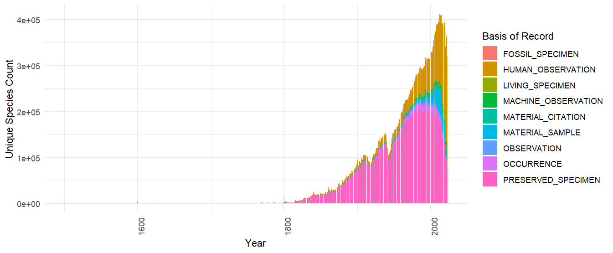

```{r setup, include=FALSE}
knitr::opts_chunk$set(echo = TRUE)
```

> This is an experimental feature, and the implementation may change. 

> If your download can be formulated using the traditional predicate downloads, it is usually going to be **much** faster to use `occ_download()`. See article [Getting Occurrence Counts From GBIF](https://docs.ropensci.org/rgbif/articles/occ_counts.html).

The experimental **Occurrence SQL Download API** allows users to query GBIF occurrences using SQL. In contrast to the [Predicate Download API](https://techdocs.gbif.org/en/data-use/api-sql-downloads), the SQL API allows selection of the columns of interest and generation of summary views of GBIF data.

SQL downloads, like regular downloads, required you to set up your **GBIF credentials**. I suggest that you follow this [short tutorial](https://docs.ropensci.org/rgbif/articles/gbif_credentials.html) before continuing. For the time being, SQL downloads are only available for preview by invited users. Contact **helpdesk\@gbif.org** to request access.

``` r
# test if your download is set up correctly 
# occ_download_sql_prep("SELECT datasetKey, countryCode, COUNT(*) FROM occurrence WHERE continent = 'EUROPE' GROUP BY datasetKey, countryCode")
occ_download_sql("SELECT datasetKey, countryCode, COUNT(*) FROM occurrence WHERE continent = 'EUROPE' GROUP BY datasetKey, countryCode")
```

`occ_download_get()` and `occ_download_import()` still work with SQL downloads.

``` r
occ_download_get("0000967-240425142415019") %>%
  occ_download_import()
```

## Supported SQL

Only `SELECT` queries are supported, and only queries against a single table named `occurrence`. `JOIN` queries and sub-queries are not allowed. Selecting `*` is also not allowed. One must explicitly select the columns needed.

`GROUP BY` queries are supported, as are basic SQL window functions (`OVER` and `PARTITION BY`). `ORDER BY` is supported.

Most common SQL operators and functions are supported, such as `AND`, `OR`, `NOT`, `IS NULL`, `RAND()`, `ROUND(…)`, `LOWER(…)`, etc. Case is ignored by the GBIF SQL parser, and all column names are returned as lowercase.

You can use `occ_download_sql_prep()` to check if your query is valid.

``` r
occ_download_sql_prep("SELECT * FROM occurrence WHERE year = 2000") 
# Should return an ERROR since "*" is not allowed
```

If you need **all** occurrence columns, you can use the regular [download interface](https://docs.ropensci.org/rgbif/articles/getting_occurrence_data.html) `occ_download(pred("year", "2000"))` instead of the SQL interface.

> Note that if you doing `GROUP BY` `COUNT(*)` type queries for a single dimension, then `occ_count(facet="x")` is usually going to be a much faster option. See article [Getting Occurrence Counts From GBIF](https://docs.ropensci.org/rgbif/articles/occ_counts.html).

To get a list of all +400 columns and definitions in the **occurrence** table, you can use `occ_download_describe("sql")$fields`.

## SQL examples - Multi-dimension Counts

One common query that is difficult to do with the traditional downloads interface is to get a occurrence counts of species by multiple dimensions. This query gets a table with **countries and species with the most occurrences published to GBIF** without having to download a large table and do the aggregation locally.

> Keep in mind that if you only need counts for one dimension, then `occ_count(facet="x")` is usually going to be a much faster option.

**Countries and species with the most occurrences published to GBIF.**

``` r
sql <-
"
SELECT publishingcountry, specieskey, COUNT(*) as occurrence_count
FROM occurrence
WHERE publishingcountry IS NOT NULL AND specieskey IS NOT NULL
GROUP BY publishingcountry, specieskey
ORDER BY occurrence_count DESC;
"
occ_download_sql(sql)
```

| publishingcountry | specieskey | occurrence_count |
|:------------------|-----------:|-----------------:|
| US                |    2495347 |         23467566 |
| US                |    2490384 |         21442333 |
| US                |    9510564 |         20975419 |
| US                |    2482507 |         20396610 |
| US                |    2482593 |         17855746 |
| US                |    9761484 |         17814101 |


## SQL examples - Time series

Here is an example that retrieves the number of species published to GBIF grouped by year and basis of record. Keep in mind that `year` in this context is the collection/event date not the publication date to GBIF.

``` r
library(rgbif)
library(ggplot2)

sql <- 'SELECT "year", basisofrecord, COUNT(DISTINCT specieskey) as unique_species_count FROM occurrence GROUP BY basisofrecord, "year"'

occ_download_sql(sql)

d <- occ_download_get('0001697-240626123714530') %>%
  occ_download_import() %>%
  filter(!year == 2024) %>%
  mutate(date = as.Date(paste0(year, "-01-01")))

ggplot(d, aes(x = date, y = unique_species_count, fill = basisofrecord)) +
  geom_bar(stat = "identity") +
  labs(x = "Year", y = "Unique Species Count", fill = "Basis of Record") +
  theme_minimal() +
  theme(axis.text.x = element_text(angle = 90, hjust = 1))
```

Note that `"year"` needs to be double quoted as it is a reserve word. This is true also for other reserve words like `"month"`, `"day"` etc.

```{r, echo = FALSE,out.width="50%"}

```

## SQL examples - Grid Functions

Making a global map of unique species counts per grid cell is a common task, but because it requires a spatial join with the chosen spatial grid, it can be difficult to do without working with sometimes extremely large amounts of occurrences.

For this reason GBIF's SQL downloads provide support for a few pre-defined [grid functions](https://techdocs.gbif.org/en/data-use/api-sql-download-functions). These functions will return a **grid cell code** for each occurrence, which can then be used to aggregate or plot the data.

-   **EEA Reference Grid**, GBIF_EEARGCode
-   **Military Grid Reference System**, GBIF_MGRSCode
-   **Quarter degree cell code**, GBIF_QDGCCode
-   **ISEA3H Grid cell code GBIF_ISEA3HCode**, GBIF_ISEA3HCode

Below is an example of working with the **Military Grid Reference System** (MGRS) grid. This example uses shapefiles from [this repository](https://github.com/klaukh/MGRS). The example shows how to produce a simple map of species counts per grid cell, using `occ_download_sql()` and the custom sql function `GBIF_MGRSCode()`.

The sql grid functions were originally designed to be used for creating [species occurrence cubes](https://b-cubed.eu/data-and-evidence). Therefore a randomization parameter was supported `0`. This should be set to 0 if you want to use the grid functions with **no randomization**.

You can download the combined shapefile I used for this example here: <https://github.com/jhnwllr/mgrs-grid>

``` r
library(sf)
library(dplyr)
library(rgbif)
library(ggplot2)
library(purrr)

sql <-
"
SELECT 
  GBIF_MGRSCode(
    100000, 
    decimalLatitude,
    decimalLongitude,
    0 
  ) AS mgrs,
  COUNT(DISTINCT speciesKey) AS unique_species_count
FROM
  occurrence
GROUP BY
  mgrs
"

# uncomment to run 
# occ_download_sql(sql) 

# change id 0029823-240906103802322 to your download id
d <- occ_download_get('0029823-240906103802322') %>%
  occ_download_import() %>%
  filter(!mgrs == "") %>%
  rename(MGRS = mgrs) 

path <- "mgrs-grid/"

mgrs_grid <- st_layers(path)$name %>%
map(~ st_read(path, layer = .) %>% st_transform(4326)) %>%
dplyr::bind_rows() %>% 
left_join(d, by = "MGRS")

p <- ggplot(mgrs_grid) +
geom_sf(aes(fill = log(unique_species_count))) +
scale_fill_viridis_c() +
theme_minimal()
```

<!-- ggsave("C:/Users/ftw712/Desktop/plot.pdf",plot = p, width = 15, height = 10, dpi = 300) -->

<!-- ggsave("C:/Users/ftw712/Desktop/plot.svg",plot = p, width = 15, height = 10, dpi = 300) -->

<!-- ggsave("C:/Users/ftw712/Desktop/plot.png",plot = p, width = 15, height = 10, dpi = 600) -->

> Note, there is an open issue with the grid MGRS where certain codes are missing from the shapefile near Austrailia. <https://github.com/ngageoint/mgrs-java/issues/4>

```{r, echo = FALSE,out.width="50%"}
knitr::include_graphics("img/species_count_grid.png")
```

<!-- In general the hardest part of working with GBIF's sql grid functions can be finding the corresponding shapefile or geojson file that matches the grid function used. -->

Below is another example working with the **EEA Reference Grid**, which only covers continental Europe.

The EEA reference shapefile for example below can be found here: <https://sdi.eea.europa.eu/data/93315b78-089d-43a5-ac76-b3df627b2e4cf>

``` r
library(sf)
library(dplyr)
library(rgbif)
library(ggplot2)
library(purrr)

sql <-
"
SELECT 
  GBIF_EEARGCode(
    10000, 
    decimalLatitude,
    decimalLongitude,
    0
  ) AS cellcode,
  COUNT(DISTINCT speciesKey) AS unique_species_count
FROM
  occurrence
GROUP BY
  cellcode
"

# uncomment to run
# occ_download_sql(sql)

# change id 0030075-240906103802322 to your download id
d <- occ_download_get('0030075-240906103802322') %>%
    occ_download_import() %>% 
    filter(!cellcode == "") 

eea_grid <- st_read("eea_v_3035_10_km_eea-ref-grid-gb_p_2013_v02_r00") %>%
mutate(cellcode = CELLCODE) %>%
left_join(d, by = "cellcode")

p <- ggplot(eea_grid) +
geom_sf(aes(fill = log(unique_species_count))) +
scale_fill_viridis_c() +
theme_minimal()
```

<!-- ggsave("C:/Users/ftw712/Desktop/plot.pdf",plot = p, width = 15, height = 10, dpi = 300) -->

<!-- ggsave("C:/Users/ftw712/Desktop/plot.jpg",plot = p, width = 15, height = 10, dpi = 600) -->

```{r, echo = FALSE,out.width="50%"}
knitr::include_graphics("img/uk-grid.jpg")
```

## Occurrence CUBE example

The SQL download API was originally designed to be used for creating [species occurrence cubes](https://b-cubed.eu/data-and-evidence). The example below shows how to create a occurrence cube using `occ_download_sql()`.

``` r
occ_download_sql(
"
SELECT 
  -- Dimensions: 
  PRINTF('%04d-%02d', \"year\", \"month\") AS yearMonth,
  GBIF_EEARGCode(
    1000,
    decimalLatitude,
    decimalLongitude,
    COALESCE(coordinateUncertaintyInMeters, 1000)
  ) AS eeaCellCode,
  familyKey,
  family,
  speciesKey,
  species,
  COALESCE(sex, 'NOT_SUPPLIED') AS sex,
  COALESCE(occurrence.lifestage.concept, 'NOT_SUPPLIED') AS lifestage,
  -- Measurements 
  COUNT(*) AS occurrences, 
  MIN(COALESCE(coordinateUncertaintyInMeters, 1000)) AS minCoordinateUncertaintyInMeters,
  MIN(GBIF_TemporalUncertainty(eventDate)) AS minTemporalUncertainty,
  -- Higher taxon measurement
  IF(ISNULL(familyKey), 
     NULL, 
       SUM(COUNT(*)) 
       OVER (PARTITION BY familyKey, 
                          PRINTF('%04d-%02d', \"year\", \"month\"),
                          GBIF_EEARGCode(1000, decimalLatitude, decimalLongitude, COALESCE(coordinateUncertaintyInMeters, 1000)))
  ) AS familyCount
FROM
  occurrence
WHERE occurrenceStatus = 'PRESENT'
  AND countryCode = 'PL'
  AND \"year\" >= 2000
  AND kingdomKey = 1
  AND hasCoordinate = TRUE
  AND (coordinateUncertaintyInMeters <= 1000 OR coordinateUncertaintyInMeters IS NULL)
  AND speciesKey IS NOT NULL
  AND NOT ARRAY_CONTAINS(issue, 'ZERO_COORDINATE')
  AND NOT ARRAY_CONTAINS(issue, 'COORDINATE_OUT_OF_RANGE')
  AND NOT ARRAY_CONTAINS(issue, 'COORDINATE_INVALID')
  AND NOT ARRAY_CONTAINS(issue, 'COUNTRY_COORDINATE_MISMATCH')
  AND \"month\" IS NOT NULL
GROUP BY
  yearMonth,
  eeaCellCode,
  familyKey,
  family,
  speciesKey,
  species,
  sex,
  lifestage
ORDER BY 
  yearMonth DESC,
  eeaCellCode ASC,
  speciesKey ASC;
"
)

```

## Further reading

-   <https://data-blog.gbif.org/post/2024-06-24-gbif-sql-downloads/>
-   <https://techdocs.gbif.org/en/data-use/api-sql-downloads>
-   <https://github.com/gbif/occurrence/tree/dev/occurrence-download/example-jobs>
