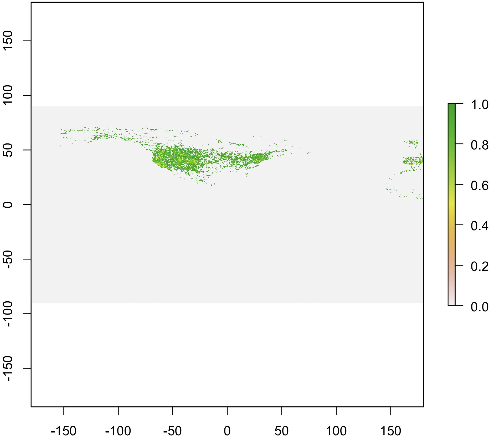

Seach and retrieve data from the Global Biodiverity Information Facilty (GBIF)

## About the package

`rgbif` is an R package to search and retrieve data from the Global Biodiverity Information Facilty (GBIF). `rgbif` wraps R code around the [GBIF API][gbifapi] to allow you to talk to GBIF from R.


## Get rgbif

Install from CRAN


```r
install.packages("rgbif")
```

Or install the development version from GitHub


```r
remotes::install_github("ropensci/rgbif")
```

Load rgbif


```r
library("rgbif")
```

## Number of occurrences

Search by type of record, all observational in this case


```r
occ_count(basisOfRecord='OBSERVATION')
#> [1] 18911003
```

Records for **Puma concolor** with lat/long data (georeferened) only. Note that `hasCoordinate` in `occ_search()` is the same as `georeferenced` in `occ_count()`.


```r
occ_count(taxonKey=2435099, georeferenced=TRUE)
#> [1] 7165
```

All georeferenced records in GBIF


```r
occ_count(georeferenced=TRUE)
#> [1] 1532830619
```

Records from Denmark


```r
denmark_code <- isocodes[grep("Denmark", isocodes$name), "code"]
occ_count(country=denmark_code)
#> [1] 42078239
```

Number of records in a particular dataset


```r
occ_count(datasetKey='9e7ea106-0bf8-4087-bb61-dfe4f29e0f17')
#> [1] 4591
```

All records from 2012


```r
occ_count(year=2012)
#> [1] 62152590
```

Records for a particular dataset, and only for preserved specimens


```r
occ_count(datasetKey='e707e6da-e143-445d-b41d-529c4a777e8b', basisOfRecord='OBSERVATION')
#> [1] 0
```

## Search for taxon names

Get possible values to be used in taxonomic rank arguments in functions


```r
taxrank()
#> [1] "kingdom"       "phylum"        "class"         "order"        
#> [5] "family"        "genus"         "species"       "subspecies"   
#> [9] "infraspecific"
```

`name_lookup()` does full text search of name usages covering the scientific and vernacular name, the species description, distribution and the entire classification across all name usages of all or some checklists. Results are ordered by relevance as this search usually returns a lot of results.

By default `name_lookup()` returns five slots of information: meta, data, facets, hierarchies, and names. hierarchies and names elements are named by their matching GBIF key in the `data.frame` in the data slot.


```r
out <- name_lookup(query='mammalia')
```


```r
names(out)
#> [1] "meta"        "data"        "facets"      "hierarchies" "names"
```


```r
out$meta
#> # A tibble: 1 x 4
#>   offset limit endOfRecords count
#>    <int> <int> <lgl>        <int>
#> 1      0   100 FALSE         2042
```


```r
head(out$data)
#> # A tibble: 6 x 28
#>      key scientificName datasetKey nubKey parentKey parent kingdom phylum
#>    <int> <chr>          <chr>       <int>     <int> <chr>  <chr>   <chr> 
#> 1 1.14e8 Mammalia       8dc469b3-…    359 114068664 Verte… Animal… Chord…
#> 2 1.57e8 Mammalia       081304be-…    359 157251235 Chord… Animal… Chord…
#> 3 1.44e8 Mammalia       bc3553e8-…    359 144211912 Chord… Animal… Chord…
#> 4 3.59e2 Mammalia       d7dddbf4-…     NA        44 Chord… Animal… Chord…
#> 5 1.35e8 Mammalia       0a423169-…    359 135216355 Chord… Animal… Chord…
#> 6 1.52e8 Mammalia       4b4931d6-…    359 152182137 Chord… Animal… Chord…
#> # … with 20 more variables: kingdomKey <int>, phylumKey <int>, classKey <int>,
#> #   canonicalName <chr>, authorship <chr>, nameType <chr>,
#> #   taxonomicStatus <chr>, rank <chr>, origin <chr>, numDescendants <int>,
#> #   numOccurrences <int>, habitats <chr>, nomenclaturalStatus <lgl>,
#> #   threatStatuses <chr>, synonym <lgl>, class <chr>, constituentKey <chr>,
#> #   extinct <lgl>, publishedIn <chr>, taxonID <chr>
```


```r
out$facets
#> NULL
```


```r
out$hierarchies[1:2]
#> $`114068957`
#>     rankkey       name
#> 1 114067672   Animalia
#> 2 114068658   Chordata
#> 3 114068664 Vertebrata
#> 
#> $`157251236`
#>     rankkey     name
#> 1 157251234 Animalia
#> 2 157251235 Chordata
```


```r
out$names[2]
#> $`168001908`
#>   vernacularName language
#> 1    njiccehasat      sme
```

Search for a genus


```r
z <- name_lookup(query='Cnaemidophorus', rank="genus")
z$data
#> # A tibble: 22 x 35
#>       key scientificName datasetKey  nubKey parentKey parent kingdom phylum
#>     <int> <chr>          <chr>        <int>     <int> <chr>  <chr>   <chr> 
#>  1 1.68e8 Cnaemidophorus cbb6498e-… 1858636 168457560 Ptero… Animal… Arthr…
#>  2 1.24e8 Cnaemidophorus fab88965-…      NA 104446806 Ptero… Metazoa Arthr…
#>  3 1.68e8 Cnaemidophorus 16c3f9cb-… 1858636 100557623 Ptero… <NA>    <NA>  
#>  4 1.69e8 Cnaemidophorus 4dd32523-… 1858636 168800971 Ptero… Animal… Arthr…
#>  5 1.56e8 Cnaemidophorus 7ddf754f-… 1858636 155857752 Ptero… Animal… Arthr…
#>  6 1.58e8 Cnaemidophorus 4cec8fef-… 1858636 157904443 Ptero… Animal… Arthr…
#>  7 1.69e8 Cnaemidophorus 4b3e4a71-… 1858636 168525701 Ptero… Animal… Arthr…
#>  8 1.59e8 Cnaemidophorus 23905003-… 1858636 159439401 Ptero… Animal… Arthr…
#>  9 1.69e8 Cnaemidophorus 848271aa-… 1858636 168992508 Lepid… Animal… <NA>  
#> 10 1.23e8 Cnaemidophoru… 90d9e8a6-… 1858636 123394987 Ptero… Animal… Arthr…
#> # … with 12 more rows, and 27 more variables: order <chr>, family <chr>,
#> #   genus <chr>, kingdomKey <int>, phylumKey <int>, classKey <int>,
#> #   orderKey <int>, familyKey <int>, genusKey <int>, canonicalName <chr>,
#> #   taxonomicStatus <chr>, rank <chr>, origin <chr>, numDescendants <int>,
#> #   numOccurrences <int>, habitats <lgl>, nomenclaturalStatus <chr>,
#> #   threatStatuses <chr>, synonym <lgl>, class <chr>, nameType <chr>,
#> #   taxonID <chr>, authorship <chr>, accordingTo <chr>, constituentKey <chr>,
#> #   publishedIn <chr>, extinct <lgl>
```

Search for the class mammalia


```r
w <- name_lookup(query='mammalia')
w$data
#> # A tibble: 100 x 28
#>       key scientificName datasetKey nubKey parentKey parent kingdom phylum
#>     <int> <chr>          <chr>       <int>     <int> <chr>  <chr>   <chr> 
#>  1 1.14e8 Mammalia       8dc469b3-…    359 114068664 Verte… Animal… Chord…
#>  2 1.57e8 Mammalia       081304be-…    359 157251235 Chord… Animal… Chord…
#>  3 1.44e8 Mammalia       bc3553e8-…    359 144211912 Chord… Animal… Chord…
#>  4 3.59e2 Mammalia       d7dddbf4-…     NA        44 Chord… Animal… Chord…
#>  5 1.35e8 Mammalia       0a423169-…    359 135216355 Chord… Animal… Chord…
#>  6 1.52e8 Mammalia       4b4931d6-…    359 152182137 Chord… Animal… Chord…
#>  7 1.42e8 Mammalia       90e4f0e7-…    359 142234654 Chord… Animal… Chord…
#>  8 1.35e8 Mammalia       5acbd076-…    359 134996932 Chord… Animal… Chord…
#>  9 1.68e8 Mammalia       a6c6cead-…    359 168001717 Verte… Animal… Chord…
#> 10 1.59e8 Mammalia       b2a18f87-…    359 159454905 Chord… Animal… Chord…
#> # … with 90 more rows, and 20 more variables: kingdomKey <int>,
#> #   phylumKey <int>, classKey <int>, canonicalName <chr>, authorship <chr>,
#> #   nameType <chr>, taxonomicStatus <chr>, rank <chr>, origin <chr>,
#> #   numDescendants <int>, numOccurrences <int>, habitats <chr>,
#> #   nomenclaturalStatus <lgl>, threatStatuses <chr>, synonym <lgl>,
#> #   class <chr>, constituentKey <chr>, extinct <lgl>, publishedIn <chr>,
#> #   taxonID <chr>
```

Look up the species Helianthus annuus


```r
m <- name_lookup(query = 'Helianthus annuus', rank="species")
m$data
#> # A tibble: 100 x 40
#>       key scientificName datasetKey  nubKey parentKey parent kingdom phylum
#>     <int> <chr>          <chr>        <int>     <int> <chr>  <chr>   <chr> 
#>  1 1.15e8 Helianthus an… ee2aac07-… 9206251 144238801 Helia… Plantae Trach…
#>  2 1.35e8 Helianthus an… f82a4f7f-… 9206251 167773411 Aster… Plantae Trach…
#>  3 1.35e8 Helianthus an… 29d2d5a6-… 9206251 168341218 Aster… Plantae Trach…
#>  4 1.28e8 Helianthus an… 41c06f1a-… 9206251 146770884 Amara… Plantae <NA>  
#>  5 1.46e8 Helianthus an… 6a97172b-… 9206251 147653302 Helia… <NA>    <NA>  
#>  6 1.63e8 Helianthus an… 88217638-… 9206251 163398972 Aster… Plantae Trach…
#>  7 1.35e8 Helianthus an… 83ca3188-… 9206251 168210720 Aster… Plantae Trach…
#>  8 1.46e8 Helianthus an… 3f5e930b-… 9206251 157140516 Helia… Plantae Angio…
#>  9 1.03e8 Helianthus an… fab88965-…      NA 103340270 Helia… Viridi… Strep…
#> 10 1.60e8 Helianthus an… 39f36f10-… 9206251 164560273 Helia… Plantae Magno…
#> # … with 90 more rows, and 32 more variables: order <chr>, family <chr>,
#> #   genus <chr>, species <chr>, kingdomKey <int>, phylumKey <int>,
#> #   classKey <int>, orderKey <int>, familyKey <int>, genusKey <int>,
#> #   speciesKey <int>, canonicalName <chr>, authorship <chr>, nameType <chr>,
#> #   taxonomicStatus <chr>, rank <chr>, origin <chr>, numDescendants <int>,
#> #   numOccurrences <int>, habitats <chr>, nomenclaturalStatus <chr>,
#> #   threatStatuses <chr>, synonym <lgl>, class <chr>, taxonID <chr>,
#> #   acceptedKey <int>, accepted <chr>, constituentKey <chr>, accordingTo <chr>,
#> #   publishedIn <chr>, basionymKey <int>, basionym <chr>
```

The function `name_usage()` works with lots of different name endpoints in GBIF, listed at https://www.gbif.org/developer/species#nameUsages


```r
name_usage(key=3119195, language="FRENCH", data='vernacularNames')
#> Records returned [0] 
#> Args [offset=0, limit=100, language=FRENCH] 
#> # A tibble: 0 x 0
```

The function `name_backbone()` is used to search against the GBIF backbone taxonomy


```r
name_backbone(name='Helianthus', rank='genus', kingdom='plants')
#> # A tibble: 1 x 20
#>   usageKey scientificName canonicalName rank  status confidence matchType
#> *    <int> <chr>          <chr>         <chr> <chr>       <int> <chr>    
#> 1  3119134 Helianthus L.  Helianthus    GENUS ACCEP…         97 EXACT    
#> # … with 13 more variables: kingdom <chr>, phylum <chr>, order <chr>,
#> #   family <chr>, genus <chr>, kingdomKey <int>, phylumKey <int>,
#> #   classKey <int>, orderKey <int>, familyKey <int>, genusKey <int>,
#> #   synonym <lgl>, class <chr>
```

The function `name_suggest()` is optimized for speed, and gives back suggested names based on query parameters.


```r
head( name_suggest(q='Puma concolor') )
#> $data
#> # A tibble: 33 x 3
#>        key canonicalName                rank      
#>      <int> <chr>                        <chr>     
#>  1 2435099 Puma concolor                SPECIES   
#>  2 8860878 Puma concolor capricornensis SUBSPECIES
#>  3 6164618 Puma concolor browni         SUBSPECIES
#>  4 8951716 Puma concolor borbensis      SUBSPECIES
#>  5 6164599 Puma concolor azteca         SUBSPECIES
#>  6 8916934 Puma concolor bangsi         SUBSPECIES
#>  7 6164622 Puma concolor puma           SUBSPECIES
#>  8 6164604 Puma concolor stanleyana     SUBSPECIES
#>  9 6164610 Puma concolor hippolestes    SUBSPECIES
#> 10 6164620 Puma concolor cougar         SUBSPECIES
#> # … with 23 more rows
#> 
#> $hierarchy
#> list()
```


## Single occurrence records

Get data for a single occurrence. Note that data is returned as a list, with slots for metadata and data.


```r
occ_get(key=855998194)
#> [[1]]
#> [[1]]$hierarchy
#>               name     key    rank
#> 1         Animalia       1 kingdom
#> 2         Chordata      44  phylum
#> 3         Mammalia     359   class
#> 4         Rodentia    1459   order
#> 5        Sciuridae    9456  family
#> 6          Sciurus 2437489   genus
#> 7 Sciurus vulgaris 8211070 species
#> 
#> [[1]]$media
#> [[1]]$media$`855998194`
#> [[1]]$media$`855998194`[[1]]
#> [[1]]$media$`855998194`[[1]][[1]]
#> [1] "none"
#> 
#> 
#> [[1]]$media$`855998194`$key
#> [1] "855998194"
#> 
#> [[1]]$media$`855998194`$species
#> [1] "Sciurus vulgaris"
#> 
#> [[1]]$media$`855998194`$decimalLatitude
#> [1] 58.40677
#> 
#> [[1]]$media$`855998194`$decimalLongitude
#> [1] 12.04386
#> 
#> [[1]]$media$`855998194`$country
#> [1] "Sweden"
#> 
#> 
#> 
#> [[1]]$data
#>         key                  scientificName decimalLatitude decimalLongitude
#> 1 855998194 Sciurus vulgaris Linnaeus, 1758        58.40677         12.04386
#>           issues
#> 1 cdround,gass84
```

Get many occurrences. `occ_get` is vectorized


```r
occ_get(key=c(855998194, 240713150))
#> [[1]]
#> [[1]]$hierarchy
#>               name     key    rank
#> 1         Animalia       1 kingdom
#> 2         Chordata      44  phylum
#> 3         Mammalia     359   class
#> 4         Rodentia    1459   order
#> 5        Sciuridae    9456  family
#> 6          Sciurus 2437489   genus
#> 7 Sciurus vulgaris 8211070 species
#> 
#> [[1]]$media
#> [[1]]$media$`855998194`
#> [[1]]$media$`855998194`[[1]]
#> [[1]]$media$`855998194`[[1]][[1]]
#> [1] "none"
#> 
#> 
#> [[1]]$media$`855998194`$key
#> [1] "855998194"
#> 
#> [[1]]$media$`855998194`$species
#> [1] "Sciurus vulgaris"
#> 
#> [[1]]$media$`855998194`$decimalLatitude
#> [1] 58.40677
#> 
#> [[1]]$media$`855998194`$decimalLongitude
#> [1] 12.04386
#> 
#> [[1]]$media$`855998194`$country
#> [1] "Sweden"
#> 
#> 
#> 
#> [[1]]$data
#>         key                  scientificName decimalLatitude decimalLongitude
#> 1 855998194 Sciurus vulgaris Linnaeus, 1758        58.40677         12.04386
#>           issues
#> 1 cdround,gass84
#> 
#> 
#> [[2]]
#> [[2]]$hierarchy
#>            name     key    rank
#> 1     Chromista       4 kingdom
#> 2  Foraminifera 8376456  phylum
#> 3  Monothalamea 7882876   class
#> 4  Astrorhizida 8142878   order
#> 5 Astrorhizidae 7747923  family
#> 6      Pelosina 7822114   genus
#> 
#> [[2]]$media
#> [[2]]$media$`240713150`
#> [[2]]$media$`240713150`[[1]]
#> [[2]]$media$`240713150`[[1]][[1]]
#> [1] "none"
#> 
#> 
#> [[2]]$media$`240713150`$key
#> [1] "240713150"
#> 
#> [[2]]$media$`240713150`$decimalLatitude
#> [1] -77.5667
#> 
#> [[2]]$media$`240713150`$decimalLongitude
#> [1] 163.583
#> 
#> [[2]]$media$`240713150`$country
#> [1] "Antarctica"
#> 
#> 
#> 
#> [[2]]$data
#>         key       scientificName decimalLatitude decimalLongitude issues
#> 1 240713150 Pelosina Brady, 1879        -77.5667          163.583 gass84
```


## Search for occurrences

Note: The maximum number of records you can get with `occ_search()` and `occ_data()` is 100,000. See https://www.gbif.org/developer/occurrence

By default `occ_search()` returns a `dplyr` like output summary in which the data printed expands based on how much data is returned, and the size of your window. You can search by scientific name:


```r
occ_search(scientificName = "Ursus americanus", limit = 20)
#> Records found [18984] 
#> Records returned [20] 
#> No. unique hierarchies [1] 
#> No. media records [20] 
#> No. facets [0] 
#> Args [limit=20, offset=0, scientificName=Ursus americanus, fields=all] 
#> # A tibble: 20 x 83
#>    key   scientificName decimalLatitude decimalLongitude issues datasetKey
#>    <chr> <chr>                    <dbl>            <dbl> <chr>  <chr>     
#>  1 2543… Ursus america…            42.5            -73.2 cdrou… 50c9509d-…
#>  2 2550… Ursus america…            35.7            -83.5 cdrou… 50c9509d-…
#>  3 2550… Ursus america…            31.3           -110.  cdrou… 50c9509d-…
#>  4 2550… Ursus america…            35.1           -118.  cdrou… 50c9509d-…
#>  5 2550… Ursus america…            25.2           -101.  cdrou… 50c9509d-…
#>  6 2550… Ursus america…            39.4           -120.  cdrou… 50c9509d-…
#>  7 2557… Ursus america…            43.8            -72.6 gass84 50c9509d-…
#>  8 2557… Ursus america…            34.0            -92.6 cdrou… 50c9509d-…
#>  9 2557… Ursus america…            34.0            -92.6 cdrou… 50c9509d-…
#> 10 2557… Ursus america…            34.0            -92.6 cdrou… 50c9509d-…
#> 11 2557… Ursus america…            46.1            -87.4 cdrou… 50c9509d-…
#> 12 2563… Ursus america…            34.4           -118.  cdrou… 50c9509d-…
#> 13 2563… Ursus america…            35.9           -121.  cdrou… 50c9509d-…
#> 14 2563… Ursus america…            35.9           -121.  cdrou… 50c9509d-…
#> 15 2563… Ursus america…            35.9           -121.  cdrou… 50c9509d-…
#> 16 2563… Ursus america…            35.9           -121.  cdrou… 50c9509d-…
#> 17 2563… Ursus america…            35.5            -82.6 cdrou… 50c9509d-…
#> 18 2563… Ursus america…            35.1           -118.  cdrou… 50c9509d-…
#> 19 2563… Ursus america…            29.2           -103.  cdrou… 50c9509d-…
#> 20 2563… Ursus america…            42.5           -123.  cdrou… 50c9509d-…
#> # … with 77 more variables: publishingOrgKey <chr>, installationKey <chr>,
#> #   publishingCountry <chr>, protocol <chr>, lastCrawled <chr>,
#> #   lastParsed <chr>, crawlId <int>, extensions <chr>, basisOfRecord <chr>,
#> #   occurrenceStatus <chr>, taxonKey <int>, kingdomKey <int>, phylumKey <int>,
#> #   classKey <int>, orderKey <int>, familyKey <int>, genusKey <int>,
#> #   speciesKey <int>, acceptedTaxonKey <int>, acceptedScientificName <chr>,
#> #   kingdom <chr>, phylum <chr>, order <chr>, family <chr>, genus <chr>,
#> #   species <chr>, genericName <chr>, specificEpithet <chr>, taxonRank <chr>,
#> #   taxonomicStatus <chr>, dateIdentified <chr>,
#> #   coordinateUncertaintyInMeters <dbl>, stateProvince <chr>, year <int>,
#> #   month <int>, day <int>, eventDate <chr>, modified <chr>,
#> #   lastInterpreted <chr>, references <chr>, license <chr>, identifiers <chr>,
#> #   facts <chr>, relations <chr>, gadm.level0.gid <chr>,
#> #   gadm.level0.name <chr>, gadm.level1.gid <chr>, gadm.level1.name <chr>,
#> #   gadm.level2.gid <chr>, gadm.level2.name <chr>, geodeticDatum <chr>,
#> #   class <chr>, countryCode <chr>, recordedByIDs <chr>, identifiedByIDs <chr>,
#> #   country <chr>, rightsHolder <chr>, identifier <chr>,
#> #   http...unknown.org.nick <chr>, verbatimEventDate <chr>, datasetName <chr>,
#> #   gbifID <chr>, collectionCode <chr>, verbatimLocality <chr>,
#> #   occurrenceID <chr>, taxonID <chr>, recordedBy <chr>, catalogNumber <chr>,
#> #   http...unknown.org.occurrenceDetails <chr>, institutionCode <chr>,
#> #   rights <chr>, eventTime <chr>, identifiedBy <chr>, identificationID <chr>,
#> #   name <chr>, informationWithheld <chr>, occurrenceRemarks <chr>
```

Or to be more precise, you can search for names first, make sure you have the right name, then pass the GBIF key to the `occ_search()` function:


```r
key <- name_suggest(q='Helianthus annuus', rank='species')$key[1]
occ_search(taxonKey=key, limit=20)
#> Records found [1631169502] 
#> Records returned [20] 
#> No. unique hierarchies [18] 
#> No. media records [20] 
#> No. facets [0] 
#> Args [limit=20, offset=0, fields=all] 
#> # A tibble: 20 x 108
#>    key   scientificName issues datasetKey publishingOrgKey installationKey
#>    <chr> <chr>          <chr>  <chr>      <chr>            <chr>          
#>  1 1039… Psittacus eri… "osii… 854cf79e-… 2e167bb0-4441-1… 3f28c5e9-59b3-…
#>  2 1086… Asplenium rad… "gass… a51fa32f-… f6e2efc9-42a3-4… b38ff2b7-c8af-…
#>  3 1095… Eugenia pyrif… ""     3b8e9d83-… ab5c0b99-5af3-4… b38ff2b7-c8af-…
#>  4 1135… Marasmius epi… ""     0afba960-… 58520c30-bafb-1… 602f7766-f762-…
#>  5 1135… Berkleasmium … ""     0afba960-… 58520c30-bafb-1… 602f7766-f762-…
#>  6 1135… Pseudovalsa u… ""     0afba960-… 58520c30-bafb-1… 602f7766-f762-…
#>  7 1135… Hemitrichia i… ""     0afba960-… 58520c30-bafb-1… 602f7766-f762-…
#>  8 1830… Diatrypella f… ""     0afba960-… 58520c30-bafb-1… 602f7766-f762-…
#>  9 1830… Cryptocline t… ""     0afba960-… 58520c30-bafb-1… 602f7766-f762-…
#> 10 1840… Asota helicon… "osii… e0b8cb67-… 7c07cec1-2925-4… 08eefeeb-e20f-…
#> 11 1840… Selepa Moore,… "osii… e0b8cb67-… 7c07cec1-2925-4… 08eefeeb-e20f-…
#> 12 1841… Lemyra impari… "txma… e0b8cb67-… 7c07cec1-2925-4… 08eefeeb-e20f-…
#> 13 1880… Limnonectes w… "gass… dce00a1f-… b554c320-0560-1… c7b49e46-602a-…
#> 14 1880… Limnonectes w… "gass… dce00a1f-… b554c320-0560-1… c7b49e46-602a-…
#> 15 1880… Limnonectes w… "gass… dce00a1f-… b554c320-0560-1… c7b49e46-602a-…
#> 16 1897… Polystichum w… "cdro… 83ae84cf-… 32e82a64-c9b4-4… 58f76e14-f21d-…
#> 17 1897… Hymenophyllum… "mulu… 83ae84cf-… 32e82a64-c9b4-4… 58f76e14-f21d-…
#> 18 1897… Epacris pauci… "cdro… 83ae84cf-… 32e82a64-c9b4-4… 58f76e14-f21d-…
#> 19 1897… Metrosideros … "cdro… 83ae84cf-… 32e82a64-c9b4-4… 58f76e14-f21d-…
#> 20 1897… Coprosma dodo… "mulu… 83ae84cf-… 32e82a64-c9b4-4… 58f76e14-f21d-…
#> # … with 102 more variables: publishingCountry <chr>, protocol <chr>,
#> #   lastCrawled <chr>, lastParsed <chr>, crawlId <int>, extensions <chr>,
#> #   basisOfRecord <chr>, individualCount <int>, occurrenceStatus <chr>,
#> #   taxonKey <int>, kingdomKey <int>, phylumKey <int>, classKey <int>,
#> #   orderKey <int>, familyKey <int>, genusKey <int>, speciesKey <int>,
#> #   acceptedTaxonKey <int>, acceptedScientificName <chr>, kingdom <chr>,
#> #   phylum <chr>, order <chr>, family <chr>, genus <chr>, species <chr>,
#> #   genericName <chr>, specificEpithet <chr>, taxonRank <chr>,
#> #   taxonomicStatus <chr>, year <int>, month <int>, eventDate <chr>,
#> #   modified <chr>, lastInterpreted <chr>, references <chr>, license <chr>,
#> #   identifiers <chr>, facts <chr>, relations <chr>, gadm <chr>, class <chr>,
#> #   recordedByIDs <chr>, identifiedByIDs <chr>, rightsHolder <chr>,
#> #   identifier <chr>, nomenclaturalCode <chr>, gbifID <chr>,
#> #   collectionCode <chr>, language <chr>, occurrenceID <chr>, type <chr>,
#> #   taxonRemarks <chr>, preparations <chr>, disposition <chr>,
#> #   recordedBy <chr>, catalogNumber <chr>, vernacularName <chr>,
#> #   previousIdentifications <chr>, institutionCode <chr>,
#> #   ownerInstitutionCode <chr>, datasetID <chr>, occurrenceRemarks <chr>,
#> #   bibliographicCitation <chr>, accessRights <chr>,
#> #   higherClassification <chr>, name <chr>, decimalLatitude <dbl>,
#> #   decimalLongitude <dbl>, dateIdentified <chr>, elevation <dbl>,
#> #   elevationAccuracy <dbl>, stateProvince <chr>, day <int>,
#> #   gadm.level0.gid <chr>, gadm.level0.name <chr>, gadm.level1.gid <chr>,
#> #   gadm.level1.name <chr>, gadm.level2.gid <chr>, gadm.level2.name <chr>,
#> #   gadm.level3.gid <chr>, gadm.level3.name <chr>, geodeticDatum <chr>,
#> #   countryCode <chr>, country <chr>, recordNumber <chr>, municipality <chr>,
#> #   locality <chr>, datasetName <chr>, identifiedBy <chr>, continent <chr>,
#> #   typifiedName <chr>, lifeStage <chr>, infraspecificEpithet <chr>,
#> #   county <chr>, associatedReferences <chr>, verbatimElevation <chr>,
#> #   higherGeography <chr>, institutionID <chr>, island <chr>,
#> #   islandGroup <chr>, …
```

You can index to different parts of the oupu; here, the metadata:


```r
occ_search(taxonKey=key)$meta
#> $offset
#> [1] 300
#> 
#> $limit
#> [1] 200
#> 
#> $endOfRecords
#> [1] FALSE
#> 
#> $count
#> [1] 1631169502
```

You can choose what fields to return. This isn't passed on to the API query to GBIF as they don't allow that, but we filter out the columns before we give the data back to you.


```r
occ_search(scientificName = "Ursus americanus", fields=c('name','basisOfRecord','protocol'), limit = 20)
#> Records found [18984] 
#> Records returned [20] 
#> No. unique hierarchies [1] 
#> No. media records [20] 
#> No. facets [0] 
#> Args [limit=20, offset=0, scientificName=Ursus americanus,
#>      fields=name,basisOfRecord,protocol] 
#> # A tibble: 20 x 2
#>    protocol    basisOfRecord    
#>    <chr>       <chr>            
#>  1 DWC_ARCHIVE HUMAN_OBSERVATION
#>  2 DWC_ARCHIVE HUMAN_OBSERVATION
#>  3 DWC_ARCHIVE HUMAN_OBSERVATION
#>  4 DWC_ARCHIVE HUMAN_OBSERVATION
#>  5 DWC_ARCHIVE HUMAN_OBSERVATION
#>  6 DWC_ARCHIVE HUMAN_OBSERVATION
#>  7 DWC_ARCHIVE HUMAN_OBSERVATION
#>  8 DWC_ARCHIVE HUMAN_OBSERVATION
#>  9 DWC_ARCHIVE HUMAN_OBSERVATION
#> 10 DWC_ARCHIVE HUMAN_OBSERVATION
#> 11 DWC_ARCHIVE HUMAN_OBSERVATION
#> 12 DWC_ARCHIVE HUMAN_OBSERVATION
#> 13 DWC_ARCHIVE HUMAN_OBSERVATION
#> 14 DWC_ARCHIVE HUMAN_OBSERVATION
#> 15 DWC_ARCHIVE HUMAN_OBSERVATION
#> 16 DWC_ARCHIVE HUMAN_OBSERVATION
#> 17 DWC_ARCHIVE HUMAN_OBSERVATION
#> 18 DWC_ARCHIVE HUMAN_OBSERVATION
#> 19 DWC_ARCHIVE HUMAN_OBSERVATION
#> 20 DWC_ARCHIVE HUMAN_OBSERVATION
```

Most parameters are vectorized, so you can pass in more than one value:


```r
splist <- c('Cyanocitta stelleri', 'Junco hyemalis', 'Aix sponsa')
keys <- sapply(splist, function(x) name_suggest(x)$key[1], USE.NAMES=FALSE)
occ_search(taxonKey=keys, limit=5)
#> Records found [NULL (1631169502), NULL (1631169502), NULL (1631169502)] 
#> Records returned [NULL (5), NULL (5), NULL (5)] 
#> No. unique hierarchies [NULL (5), NULL (5), NULL (5)] 
#> No. media records [NULL (5), NULL (5), NULL (5)] 
#> No. facets [NULL (0), NULL (0), NULL (0)] 
#> Args [limit=5, offset=0, taxonKey=NULL,NULL,NULL, fields=all] 
#> 3 requests; First 10 rows of data from NULL
#> 
#> # A tibble: 5 x 97
#>   key   scientificName issues datasetKey publishingOrgKey installationKey
#>   <chr> <chr>          <chr>  <chr>      <chr>            <chr>          
#> 1 1039… Psittacus eri… "osii… 854cf79e-… 2e167bb0-4441-1… 3f28c5e9-59b3-…
#> 2 1086… Asplenium rad… "gass… a51fa32f-… f6e2efc9-42a3-4… b38ff2b7-c8af-…
#> 3 1095… Eugenia pyrif… ""     3b8e9d83-… ab5c0b99-5af3-4… b38ff2b7-c8af-…
#> 4 1135… Marasmius epi… ""     0afba960-… 58520c30-bafb-1… 602f7766-f762-…
#> 5 1135… Berkleasmium … ""     0afba960-… 58520c30-bafb-1… 602f7766-f762-…
#> # … with 91 more variables: publishingCountry <chr>, protocol <chr>,
#> #   lastCrawled <chr>, lastParsed <chr>, crawlId <int>, extensions <chr>,
#> #   basisOfRecord <chr>, individualCount <int>, occurrenceStatus <chr>,
#> #   taxonKey <int>, kingdomKey <int>, phylumKey <int>, classKey <int>,
#> #   orderKey <int>, familyKey <int>, genusKey <int>, speciesKey <int>,
#> #   acceptedTaxonKey <int>, acceptedScientificName <chr>, kingdom <chr>,
#> #   phylum <chr>, order <chr>, family <chr>, genus <chr>, species <chr>,
#> #   genericName <chr>, specificEpithet <chr>, taxonRank <chr>,
#> #   taxonomicStatus <chr>, year <int>, month <int>, eventDate <chr>,
#> #   modified <chr>, lastInterpreted <chr>, references <chr>, license <chr>,
#> #   identifiers <chr>, facts <chr>, relations <chr>, gadm <chr>, class <chr>,
#> #   recordedByIDs <chr>, identifiedByIDs <chr>, rightsHolder <chr>,
#> #   identifier <chr>, nomenclaturalCode <chr>, gbifID <chr>,
#> #   collectionCode <chr>, language <chr>, occurrenceID <chr>, type <chr>,
#> #   taxonRemarks <chr>, preparations <chr>, disposition <chr>,
#> #   recordedBy <chr>, catalogNumber <chr>, vernacularName <chr>,
#> #   previousIdentifications <chr>, institutionCode <chr>,
#> #   ownerInstitutionCode <chr>, datasetID <chr>, occurrenceRemarks <chr>,
#> #   bibliographicCitation <chr>, accessRights <chr>,
#> #   higherClassification <chr>, name <chr>, decimalLatitude <dbl>,
#> #   decimalLongitude <dbl>, dateIdentified <chr>, elevation <dbl>,
#> #   elevationAccuracy <dbl>, stateProvince <chr>, day <int>,
#> #   gadm.level0.gid <chr>, gadm.level0.name <chr>, gadm.level1.gid <chr>,
#> #   gadm.level1.name <chr>, gadm.level2.gid <chr>, gadm.level2.name <chr>,
#> #   gadm.level3.gid <chr>, gadm.level3.name <chr>, geodeticDatum <chr>,
#> #   countryCode <chr>, country <chr>, recordNumber <chr>, municipality <chr>,
#> #   locality <chr>, datasetName <chr>, identifiedBy <chr>, continent <chr>,
#> #   typifiedName <chr>
```


********************

## Maps

Using thet GBIF map web tile service, making a raster and visualizing it.


```r
x <- map_fetch(taxonKey = 2480498, year = 2000:2017)
library(raster)
plot(x)
```



[gbifapi]: https://www.gbif.org/developer/summary
