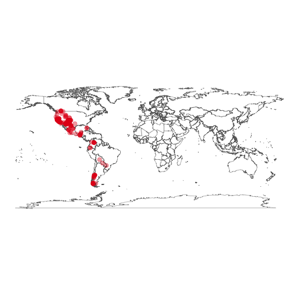

<!--
%\VignetteEngine{knitr::knitr}
%\VignetteIndexEntry{rgbif introduction}
%\VignetteEncoding{UTF-8}
-->


rgbif introduction
======

Seach and retrieve data from the Global Biodiverity Information Facilty (GBIF)

## About the package

`rgbif` is an R package to search and retrieve data from the Global Biodiverity Information Facilty (GBIF). `rgbif` wraps R code around the [GBIF API][gbifapi] to allow you to talk to GBIF from R.


## Get rgbif

Install from CRAN


```r
install.packages("rgbif")
```

Or install the development version from GitHub


```r
devtools::install_github("ropensci/rgbif")
```

Load rgbif


```r
library("rgbif")
```

## Number of occurrences

Search by type of record, all observational in this case


```r
occ_count(basisOfRecord='OBSERVATION')
#> [1] 21738469
```

Records for **Puma concolor** with lat/long data (georeferened) only. Note that `hasCoordinate` in `occ_search()` is the same as `georeferenced` in `occ_count()`.


```r
occ_count(taxonKey=2435099, georeferenced=TRUE)
#> [1] 4043
```

All georeferenced records in GBIF


```r
occ_count(georeferenced=TRUE)
#> [1] 919056029
```

Records from Denmark


```r
denmark_code <- isocodes[grep("Denmark", isocodes$name), "code"]
occ_count(country=denmark_code)
#> [1] 27242621
```

Number of records in a particular dataset


```r
occ_count(datasetKey='9e7ea106-0bf8-4087-bb61-dfe4f29e0f17')
#> [1] 4591
```

All records from 2012


```r
occ_count(year=2012)
#> [1] 50217952
```

Records for a particular dataset, and only for preserved specimens


```r
occ_count(datasetKey='e707e6da-e143-445d-b41d-529c4a777e8b', basisOfRecord='OBSERVATION')
#> [1] 0
```

## Search for taxon names

Get possible values to be used in taxonomic rank arguments in functions


```r
taxrank()
#> [1] "kingdom"       "phylum"        "class"         "order"        
#> [5] "family"        "genus"         "species"       "subspecies"   
#> [9] "infraspecific"
```

`name_lookup()` does full text search of name usages covering the scientific and vernacular name, the species description, distribution and the entire classification across all name usages of all or some checklists. Results are ordered by relevance as this search usually returns a lot of results.

By default `name_lookup()` returns five slots of information: meta, data, facets, hierarchies, and names. hierarchies and names elements are named by their matching GBIF key in the `data.frame` in the data slot.


```r
out <- name_lookup(query='mammalia')
```


```r
names(out)
#> [1] "meta"        "data"        "facets"      "hierarchies" "names"
```


```r
out$meta
#> # A tibble: 1 x 4
#>   offset limit endOfRecords count
#>    <int> <int> <lgl>        <int>
#> 1      0   100 FALSE          955
```


```r
head(out$data)
#> # A tibble: 6 x 25
#>       key scientificName datasetKey nubKey parentKey parent kingdom phylum
#>     <int> <chr>          <chr>       <int>     <int> <chr>  <chr>   <chr> 
#> 1  1.35e8 Mammalia       79c8c7d3-…    359 135011046 Chord… Animal… Chord…
#> 2  1.35e8 Mammalia       b0135100-…    359 135025806 Chord… Animal… Chord…
#> 3  1.35e8 Mammalia       04ffa69d-…    359 135034454 Chord… Animal… Chord…
#> 4  1.35e8 Mammalia       7b3f4866-…    359 135080672 Chord… Animal… Chord…
#> 5  1.35e8 Mammalia       1ddab917-…    359 135215962 Chord… Animal… Chord…
#> 6  1.35e8 Mammalia       97b24147-…    359 135216923 Chord… Animal… Chord…
#> # ... with 17 more variables: kingdomKey <int>, phylumKey <int>,
#> #   classKey <int>, canonicalName <chr>, authorship <chr>, nameType <chr>,
#> #   taxonomicStatus <chr>, rank <chr>, origin <chr>, numDescendants <int>,
#> #   numOccurrences <int>, habitats <lgl>, nomenclaturalStatus <lgl>,
#> #   threatStatuses <lgl>, synonym <lgl>, class <chr>, taxonID <chr>
```


```r
out$facets
#> NULL
```


```r
out$hierarchies[1:2]
#> $`135011053`
#>     rankkey     name
#> 1 135010932 Animalia
#> 2 135011046 Chordata
#> 
#> $`135025807`
#>     rankkey     name
#> 1 135025805 Animalia
#> 2 135025806 Chordata
```


```r
out$names[2]
#> $<NA>
#> NULL
```

Search for a genus


```r
head(name_lookup(query='Cnaemidophorus', rank="genus", return="data"))
#> # A tibble: 6 x 34
#>       key scientificName datasetKey nubKey parentKey parent kingdom phylum
#>     <int> <chr>          <chr>       <int>     <int> <chr>  <chr>   <chr> 
#> 1  1.34e8 Cnaemidophorus 23905003-… 1.86e6 134031457 Ptero… Animal… Arthr…
#> 2  1.33e8 Cnaemidophorus 4cec8fef-… 1.86e6 133063901 Ptero… <NA>    Arthr…
#> 3  1.46e8 Cnaemidophorus d16563e0-… 1.86e6 145977994 Ptero… Animal… Arthr…
#> 4  1.41e8 Cnaemidophorus de8934f4-… 1.86e6 140665516 Ptero… Animal… Arthr…
#> 5  1.44e8 Cnaemidophorus 7ddf754f-… 1.86e6 144455664 Ptero… Animal… Arthr…
#> 6  1.44e8 Cnaemidophorus 16c3f9cb-… 1.86e6 100557623 Ptero… <NA>    <NA>  
#> # ... with 26 more variables: order <chr>, family <chr>, genus <chr>,
#> #   kingdomKey <int>, phylumKey <int>, classKey <int>, orderKey <int>,
#> #   familyKey <int>, genusKey <int>, canonicalName <chr>,
#> #   authorship <chr>, nameType <chr>, taxonomicStatus <chr>, rank <chr>,
#> #   origin <chr>, numDescendants <int>, numOccurrences <int>,
#> #   habitats <lgl>, nomenclaturalStatus <lgl>, threatStatuses <lgl>,
#> #   synonym <lgl>, class <chr>, taxonID <chr>, publishedIn <chr>,
#> #   extinct <lgl>, constituentKey <chr>
```

Search for the class mammalia


```r
head(name_lookup(query='mammalia', return = 'data'))
#> # A tibble: 6 x 25
#>       key scientificName datasetKey nubKey parentKey parent kingdom phylum
#>     <int> <chr>          <chr>       <int>     <int> <chr>  <chr>   <chr> 
#> 1  1.35e8 Mammalia       79c8c7d3-…    359 135011046 Chord… Animal… Chord…
#> 2  1.35e8 Mammalia       b0135100-…    359 135025806 Chord… Animal… Chord…
#> 3  1.35e8 Mammalia       04ffa69d-…    359 135034454 Chord… Animal… Chord…
#> 4  1.35e8 Mammalia       7b3f4866-…    359 135080672 Chord… Animal… Chord…
#> 5  1.35e8 Mammalia       1ddab917-…    359 135215962 Chord… Animal… Chord…
#> 6  1.35e8 Mammalia       97b24147-…    359 135216923 Chord… Animal… Chord…
#> # ... with 17 more variables: kingdomKey <int>, phylumKey <int>,
#> #   classKey <int>, canonicalName <chr>, authorship <chr>, nameType <chr>,
#> #   taxonomicStatus <chr>, rank <chr>, origin <chr>, numDescendants <int>,
#> #   numOccurrences <int>, habitats <lgl>, nomenclaturalStatus <lgl>,
#> #   threatStatuses <lgl>, synonym <lgl>, class <chr>, taxonID <chr>
```

Look up the species Helianthus annuus


```r
head(name_lookup(query = 'Helianthus annuus', rank="species", return = 'data'))
#> # A tibble: 6 x 40
#>       key scientificName datasetKey nubKey parentKey parent kingdom phylum
#>     <int> <chr>          <chr>       <int>     <int> <chr>  <chr>   <chr> 
#> 1  1.35e8 Helianthus an… 29d2d5a6-… 9.21e6 142663894 Aster… Plantae Trach…
#> 2  1.28e8 Helianthus an… 41c06f1a-… 9.21e6 143979234 Amara… Plantae <NA>  
#> 3  1.46e8 Helianthus an… 6a97172b-… 9.21e6 145984152 Helia… <NA>    <NA>  
#> 4  1.03e8 Helianthus an… fab88965-… 9.21e6 103340270 Helia… Viridi… Strep…
#> 5  1.46e8 Helianthus an… 3f5e930b-… 9.21e6 145966117 Helia… Plantae Angio…
#> 6  1.35e8 Helianthus an… 3cabcf37-… 9.21e6 140418759 Aster… Plantae Trach…
#> # ... with 32 more variables: order <chr>, family <chr>, species <chr>,
#> #   kingdomKey <int>, phylumKey <int>, classKey <int>, orderKey <int>,
#> #   familyKey <int>, speciesKey <int>, canonicalName <chr>,
#> #   nameType <chr>, taxonomicStatus <chr>, rank <chr>, origin <chr>,
#> #   numDescendants <int>, numOccurrences <int>, taxonID <chr>,
#> #   habitats <chr>, nomenclaturalStatus <chr>, threatStatuses <lgl>,
#> #   synonym <lgl>, class <chr>, genus <chr>, genusKey <int>,
#> #   authorship <chr>, acceptedKey <int>, accepted <chr>,
#> #   constituentKey <chr>, publishedIn <chr>, accordingTo <chr>,
#> #   basionymKey <int>, basionym <chr>
```

The function `name_usage()` works with lots of different name endpoints in GBIF, listed at [http://www.gbif.org/developer/species#nameUsages](http://www.gbif.org/developer/species#nameUsages).


```r
name_usage(key=3119195, language="FRENCH", data='vernacularNames')
#> $meta
#> # A tibble: 1 x 3
#>   offset limit endOfRecords
#>    <int> <int> <lgl>       
#> 1      0   100 TRUE        
#> 
#> $data
#> # A tibble: 0 x 0
```

The function `name_backbone()` is used to search against the GBIF backbone taxonomy


```r
name_backbone(name='Helianthus', rank='genus', kingdom='plants')
#> $usageKey
#> [1] 3119134
#> 
#> $scientificName
#> [1] "Helianthus L."
#> 
#> $canonicalName
#> [1] "Helianthus"
#> 
#> $rank
#> [1] "GENUS"
#> 
#> $status
#> [1] "ACCEPTED"
#> 
#> $confidence
#> [1] 97
#> 
#> $matchType
#> [1] "EXACT"
#> 
#> $kingdom
#> [1] "Plantae"
#> 
#> $phylum
#> [1] "Tracheophyta"
#> 
#> $order
#> [1] "Asterales"
#> 
#> $family
#> [1] "Asteraceae"
#> 
#> $genus
#> [1] "Helianthus"
#> 
#> $kingdomKey
#> [1] 6
#> 
#> $phylumKey
#> [1] 7707728
#> 
#> $classKey
#> [1] 220
#> 
#> $orderKey
#> [1] 414
#> 
#> $familyKey
#> [1] 3065
#> 
#> $genusKey
#> [1] 3119134
#> 
#> $synonym
#> [1] FALSE
#> 
#> $class
#> [1] "Magnoliopsida"
```

The function `name_suggest()` is optimized for speed, and gives back suggested names based on query parameters.


```r
head( name_suggest(q='Puma concolor') )
#> # A tibble: 6 x 3
#>       key canonicalName              rank      
#>     <int> <chr>                      <chr>     
#> 1 2435099 Puma concolor              SPECIES   
#> 2 6164589 Puma concolor anthonyi     SUBSPECIES
#> 3 6164611 Puma concolor mayensis     SUBSPECIES
#> 4 6164613 Puma concolor schorgeri    SUBSPECIES
#> 5 8766647 Puma concolor pearsoni     SUBSPECIES
#> 6 9037937 Puma concolor soderstromii SUBSPECIES
```


## Single occurrence records

Get data for a single occurrence. Note that data is returned as a list, with slots for metadata and data, or as a hierarchy, or just data.

Just data


```r
occ_get(key=855998194, return='data')
#>               name       key decimalLatitude decimalLongitude
#> 1 Sciurus vulgaris 855998194        58.40677         12.04386
#>                 issues
#> 1 cdround,gass84,rdatm
```

Just taxonomic hierarchy


```r
occ_get(key=855998194, return='hier')
#>               name     key    rank
#> 1         Animalia       1 kingdom
#> 2         Chordata      44  phylum
#> 3         Mammalia     359   class
#> 4         Rodentia    1459   order
#> 5        Sciuridae    9456  family
#> 6          Sciurus 2437489   genus
#> 7 Sciurus vulgaris 8211070 species
```

All data, or leave return parameter blank


```r
occ_get(key=855998194, return='all')
#> $hierarchy
#>               name     key    rank
#> 1         Animalia       1 kingdom
#> 2         Chordata      44  phylum
#> 3         Mammalia     359   class
#> 4         Rodentia    1459   order
#> 5        Sciuridae    9456  family
#> 6          Sciurus 2437489   genus
#> 7 Sciurus vulgaris 8211070 species
#> 
#> $media
#> list()
#> 
#> $data
#>               name       key decimalLatitude decimalLongitude
#> 1 Sciurus vulgaris 855998194        58.40677         12.04386
#>                 issues
#> 1 cdround,gass84,rdatm
```

Get many occurrences. `occ_get` is vectorized


```r
occ_get(key=c(855998194, 1425976049, 240713150), return='data')
#>               name        key decimalLatitude decimalLongitude
#> 1 Sciurus vulgaris  855998194        58.40677        12.043857
#> 2    Cygnus cygnus 1425976049        58.26546         7.651751
#> 3         Pelosina  240713150       -77.56670       163.582993
#>                 issues
#> 1 cdround,gass84,rdatm
#> 2       cdround,gass84
#> 3   bri,cdround,gass84
```


## Search for occurrences

By default `occ_search()` returns a `dplyr` like output summary in which the data printed expands based on how much data is returned, and the size of your window. You can search by scientific name:


```r
occ_search(scientificName = "Ursus americanus", limit = 20)
#> Records found [10689] 
#> Records returned [20] 
#> No. unique hierarchies [1] 
#> No. media records [19] 
#> No. facets [0] 
#> Args [limit=20, offset=0, scientificName=Ursus americanus, fields=all] 
#> # A tibble: 20 x 69
#>    name        key decimalLatitude decimalLongitude issues  datasetKey    
#>    <chr>     <int>           <dbl>            <dbl> <chr>   <chr>         
#>  1 Ursus …  1.84e9            49.4           -123.  cdroun… 50c9509d-22c7…
#>  2 Ursus …  1.81e9            37.7           -120.  cdroun… 50c9509d-22c7…
#>  3 Ursus …  1.80e9            30.0            -84.3 cdroun… 50c9509d-22c7…
#>  4 Ursus …  1.81e9            42.0           -124.  cdroun… 50c9509d-22c7…
#>  5 Ursus …  1.81e9            25.4           -101.  gass84  50c9509d-22c7…
#>  6 Ursus …  1.81e9            40.8            -81.7 cdroun… 50c9509d-22c7…
#>  7 Ursus …  1.80e9            29.3           -103.  cdroun… 50c9509d-22c7…
#>  8 Ursus …  1.81e9            34.4           -119.  gass84  50c9509d-22c7…
#>  9 Ursus …  1.84e9            44.9           -110.  cdroun… 50c9509d-22c7…
#> 10 Ursus …  1.84e9            34.0           -117.  gass84  50c9509d-22c7…
#> 11 Ursus …  1.83e9            44.8            -72.7 cdroun… 50c9509d-22c7…
#> 12 Ursus …  1.81e9            35.8            -83.6 cdroun… 50c9509d-22c7…
#> 13 Ursus …  1.83e9            34.0           -117.  gass84  50c9509d-22c7…
#> 14 Ursus …  1.81e9            34.4           -120.  cdroun… 50c9509d-22c7…
#> 15 Ursus …  1.83e9            25.4           -101.  cdroun… 50c9509d-22c7…
#> 16 Ursus …  1.84e9            34.0           -117.  gass84  50c9509d-22c7…
#> 17 Ursus …  1.81e9            39.1           -120.  cdroun… 50c9509d-22c7…
#> 18 Ursus …  1.84e9            35.7            -83.5 cdroun… 50c9509d-22c7…
#> 19 Ursus …  1.84e9            37.8            -90.7 cdroun… 50c9509d-22c7…
#> 20 Ursus …  1.84e9            35.8            -83.5 cdroun… 50c9509d-22c7…
#> # ... with 63 more variables: publishingOrgKey <chr>,
#> #   publishingCountry <chr>, protocol <chr>, lastCrawled <chr>,
#> #   lastParsed <chr>, crawlId <int>, extensions <chr>,
#> #   basisOfRecord <chr>, taxonKey <int>, kingdomKey <int>,
#> #   phylumKey <int>, classKey <int>, orderKey <int>, familyKey <int>,
#> #   genusKey <int>, speciesKey <int>, scientificName <chr>, kingdom <chr>,
#> #   phylum <chr>, order <chr>, family <chr>, genus <chr>, species <chr>,
#> #   genericName <chr>, specificEpithet <chr>, taxonRank <chr>,
#> #   dateIdentified <chr>, year <int>, month <int>, day <int>,
#> #   eventDate <chr>, modified <chr>, lastInterpreted <chr>,
#> #   references <chr>, license <chr>, identifiers <chr>, facts <chr>,
#> #   relations <chr>, geodeticDatum <chr>, class <chr>, countryCode <chr>,
#> #   country <chr>, rightsHolder <chr>, identifier <chr>,
#> #   verbatimEventDate <chr>, datasetName <chr>, collectionCode <chr>,
#> #   gbifID <chr>, verbatimLocality <chr>, occurrenceID <chr>,
#> #   taxonID <chr>, recordedBy <chr>, catalogNumber <chr>,
#> #   http...unknown.org.occurrenceDetails <chr>, institutionCode <chr>,
#> #   rights <chr>, eventTime <chr>, occurrenceRemarks <chr>,
#> #   http...unknown.org.http_..rs.gbif.org.terms.1.0.Multimedia <chr>,
#> #   identificationID <chr>, infraspecificEpithet <chr>,
#> #   coordinateUncertaintyInMeters <dbl>, informationWithheld <chr>
```

Or to be more precise, you can search for names first, make sure you have the right name, then pass the GBIF key to the `occ_search()` function:


```r
key <- name_suggest(q='Helianthus annuus', rank='species')$key[1]
occ_search(taxonKey=key, limit=20)
#> Records found [41219] 
#> Records returned [20] 
#> No. unique hierarchies [1] 
#> No. media records [15] 
#> No. facets [0] 
#> Args [limit=20, offset=0, taxonKey=9206251, fields=all] 
#> # A tibble: 20 x 91
#>    name        key decimalLatitude decimalLongitude issues   datasetKey   
#>    <chr>     <int>           <dbl>            <dbl> <chr>    <chr>        
#>  1 Helian…  1.81e9            52.6             10.1 cdround… 6ac3f774-d9f…
#>  2 Helian…  1.84e9             0                0   cucdmis… d2470ef8-edf…
#>  3 Helian…  1.81e9            32.0           -102.  cdround… 50c9509d-22c…
#>  4 Helian…  1.84e9            33.9           -117.  cdround… 50c9509d-22c…
#>  5 Helian…  1.82e9            56.6             16.4 cdround… 38b4c89f-584…
#>  6 Helian…  1.84e9            34.1           -116.  gass84   50c9509d-22c…
#>  7 Helian…  1.81e9            25.7           -100.  cdround… 50c9509d-22c…
#>  8 Helian…  1.82e9            56.6             16.6 cdround… 38b4c89f-584…
#>  9 Helian…  1.81e9            25.6           -100.  cdround… 50c9509d-22c…
#> 10 Helian…  1.82e9            59.8             17.5 gass84,… 38b4c89f-584…
#> 11 Helian…  1.83e9            34.0           -117.  cdround… 50c9509d-22c…
#> 12 Helian…  1.83e9            58.6             16.2 gass84,… 38b4c89f-584…
#> 13 Helian…  1.83e9            58.4             14.9 gass84,… 38b4c89f-584…
#> 14 Helian…  1.81e9            25.7           -100.  cdround… 50c9509d-22c…
#> 15 Helian…  1.84e9            26.2            -98.3 cdround… 50c9509d-22c…
#> 16 Helian…  1.84e9            25.8           -100.  cdround… 50c9509d-22c…
#> 17 Helian…  1.85e9            23.7            -99.2 cdround… 50c9509d-22c…
#> 18 Helian…  1.84e9           -43.6            173.  cdround… 50c9509d-22c…
#> 19 Helian…  1.84e9            23.8           -107.  cdround… 50c9509d-22c…
#> 20 Helian…  1.84e9            23.9           -107.  cdround… 50c9509d-22c…
#> # ... with 85 more variables: publishingOrgKey <chr>,
#> #   publishingCountry <chr>, protocol <chr>, lastCrawled <chr>,
#> #   lastParsed <chr>, crawlId <int>, extensions <chr>,
#> #   basisOfRecord <chr>, taxonKey <int>, kingdomKey <int>,
#> #   phylumKey <int>, classKey <int>, orderKey <int>, familyKey <int>,
#> #   genusKey <int>, speciesKey <int>, scientificName <chr>, kingdom <chr>,
#> #   phylum <chr>, order <chr>, family <chr>, genus <chr>, species <chr>,
#> #   genericName <chr>, specificEpithet <chr>, taxonRank <chr>,
#> #   coordinateUncertaintyInMeters <dbl>, year <int>, month <int>,
#> #   day <int>, eventDate <chr>, lastInterpreted <chr>, license <chr>,
#> #   identifiers <chr>, facts <chr>, relations <chr>, geodeticDatum <chr>,
#> #   class <chr>, countryCode <chr>, country <chr>, recordedBy <chr>,
#> #   catalogNumber <chr>, institutionCode <chr>, locality <chr>,
#> #   collectionCode <chr>, gbifID <chr>,
#> #   http...unknown.org.http_..rs.gbif.org.terms.1.0.Multimedia <chr>,
#> #   elevation <dbl>, elevationAccuracy <dbl>, continent <chr>,
#> #   stateProvince <chr>, rightsHolder <chr>, recordNumber <chr>,
#> #   identifier <chr>, municipality <chr>, datasetName <chr>,
#> #   language <chr>, occurrenceID <chr>, type <chr>,
#> #   ownerInstitutionCode <chr>, occurrenceRemarks <chr>,
#> #   dateIdentified <chr>, modified <chr>, references <chr>,
#> #   verbatimEventDate <chr>, verbatimLocality <chr>, taxonID <chr>,
#> #   http...unknown.org.occurrenceDetails <chr>, rights <chr>,
#> #   eventTime <chr>, identificationID <chr>, individualCount <int>,
#> #   county <chr>, identificationVerificationStatus <chr>,
#> #   occurrenceStatus <chr>, vernacularName <chr>, taxonConceptID <chr>,
#> #   informationWithheld <chr>, endDayOfYear <chr>, startDayOfYear <chr>,
#> #   datasetID <chr>, accessRights <chr>, higherClassification <chr>,
#> #   habitat <chr>, identifiedBy <chr>
```

Like many functions in `rgbif`, you can choose what to return with the `return` parameter, here, just returning the metadata:


```r
occ_search(taxonKey=key, return='meta')
#> # A tibble: 1 x 4
#>   offset limit endOfRecords count
#> *  <int> <int> <lgl>        <int>
#> 1    300   200 FALSE        41219
```

You can choose what fields to return. This isn't passed on to the API query to GBIF as they don't allow that, but we filter out the columns before we give the data back to you.


```r
occ_search(scientificName = "Ursus americanus", fields=c('name','basisOfRecord','protocol'), limit = 20)
#> Records found [10689] 
#> Records returned [20] 
#> No. unique hierarchies [1] 
#> No. media records [19] 
#> No. facets [0] 
#> Args [limit=20, offset=0, scientificName=Ursus americanus,
#>      fields=name,basisOfRecord,protocol] 
#> # A tibble: 20 x 3
#>    name             protocol    basisOfRecord    
#>    <chr>            <chr>       <chr>            
#>  1 Ursus americanus DWC_ARCHIVE HUMAN_OBSERVATION
#>  2 Ursus americanus DWC_ARCHIVE HUMAN_OBSERVATION
#>  3 Ursus americanus DWC_ARCHIVE HUMAN_OBSERVATION
#>  4 Ursus americanus DWC_ARCHIVE HUMAN_OBSERVATION
#>  5 Ursus americanus DWC_ARCHIVE HUMAN_OBSERVATION
#>  6 Ursus americanus DWC_ARCHIVE HUMAN_OBSERVATION
#>  7 Ursus americanus DWC_ARCHIVE HUMAN_OBSERVATION
#>  8 Ursus americanus DWC_ARCHIVE HUMAN_OBSERVATION
#>  9 Ursus americanus DWC_ARCHIVE HUMAN_OBSERVATION
#> 10 Ursus americanus DWC_ARCHIVE HUMAN_OBSERVATION
#> 11 Ursus americanus DWC_ARCHIVE HUMAN_OBSERVATION
#> 12 Ursus americanus DWC_ARCHIVE HUMAN_OBSERVATION
#> 13 Ursus americanus DWC_ARCHIVE HUMAN_OBSERVATION
#> 14 Ursus americanus DWC_ARCHIVE HUMAN_OBSERVATION
#> 15 Ursus americanus DWC_ARCHIVE HUMAN_OBSERVATION
#> 16 Ursus americanus DWC_ARCHIVE HUMAN_OBSERVATION
#> 17 Ursus americanus DWC_ARCHIVE HUMAN_OBSERVATION
#> 18 Ursus americanus DWC_ARCHIVE HUMAN_OBSERVATION
#> 19 Ursus americanus DWC_ARCHIVE HUMAN_OBSERVATION
#> 20 Ursus americanus DWC_ARCHIVE HUMAN_OBSERVATION
```

Most parameters are vectorized, so you can pass in more than one value:


```r
splist <- c('Cyanocitta stelleri', 'Junco hyemalis', 'Aix sponsa')
keys <- sapply(splist, function(x) name_suggest(x)$key[1], USE.NAMES=FALSE)
occ_search(taxonKey=keys, limit=5)
#> Occ. found [2482598 (708924), 9362842 (3818008), 2498387 (1246200)] 
#> Occ. returned [2482598 (5), 9362842 (5), 2498387 (5)] 
#> No. unique hierarchies [2482598 (1), 9362842 (1), 2498387 (1)] 
#> No. media records [2482598 (5), 9362842 (5), 2498387 (3)] 
#> No. facets [2482598 (0), 9362842 (0), 2498387 (0)] 
#> Args [limit=5, offset=0, taxonKey=2482598,9362842,2498387, fields=all] 
#> 3 requests; First 10 rows of data from 2482598
#> 
#> # A tibble: 5 x 67
#>   name         key decimalLatitude decimalLongitude issues  datasetKey    
#>   <chr>      <int>           <dbl>            <dbl> <chr>   <chr>         
#> 1 Cyanoci…  1.80e9            37.2            -122. gass84  50c9509d-22c7…
#> 2 Cyanoci…  1.80e9            49.2            -124. cdroun… 50c9509d-22c7…
#> 3 Cyanoci…  1.81e9            49.2            -124. cdroun… 50c9509d-22c7…
#> 4 Cyanoci…  1.81e9            49.2            -124. cdroun… 50c9509d-22c7…
#> 5 Cyanoci…  1.81e9            48.4            -124. cdroun… 50c9509d-22c7…
#> # ... with 61 more variables: publishingOrgKey <chr>,
#> #   publishingCountry <chr>, protocol <chr>, lastCrawled <chr>,
#> #   lastParsed <chr>, crawlId <int>, extensions <chr>,
#> #   basisOfRecord <chr>, taxonKey <int>, kingdomKey <int>,
#> #   phylumKey <int>, classKey <int>, orderKey <int>, familyKey <int>,
#> #   genusKey <int>, speciesKey <int>, scientificName <chr>, kingdom <chr>,
#> #   phylum <chr>, order <chr>, family <chr>, genus <chr>, species <chr>,
#> #   genericName <chr>, specificEpithet <chr>, taxonRank <chr>,
#> #   dateIdentified <chr>, coordinateUncertaintyInMeters <dbl>, year <int>,
#> #   month <int>, day <int>, eventDate <chr>, modified <chr>,
#> #   lastInterpreted <chr>, references <chr>, license <chr>,
#> #   identifiers <chr>, facts <chr>, relations <chr>, geodeticDatum <chr>,
#> #   class <chr>, countryCode <chr>, country <chr>, rightsHolder <chr>,
#> #   identifier <chr>, verbatimEventDate <chr>, datasetName <chr>,
#> #   collectionCode <chr>, gbifID <chr>, verbatimLocality <chr>,
#> #   occurrenceID <chr>, taxonID <chr>, recordedBy <chr>,
#> #   catalogNumber <chr>, http...unknown.org.occurrenceDetails <chr>,
#> #   institutionCode <chr>, rights <chr>, eventTime <chr>,
#> #   occurrenceRemarks <chr>,
#> #   http...unknown.org.http_..rs.gbif.org.terms.1.0.Multimedia <chr>,
#> #   identificationID <chr>
```


********************

## Maps

Using thet GBIF map web tile service, making a raster and visualizing it.


```r
x <- map_fetch(search = "taxonKey", id = 3118771, year = 2010)
library(raster)
plot(x)
```



[gbifapi]: http://www.gbif.org/developer/summary
